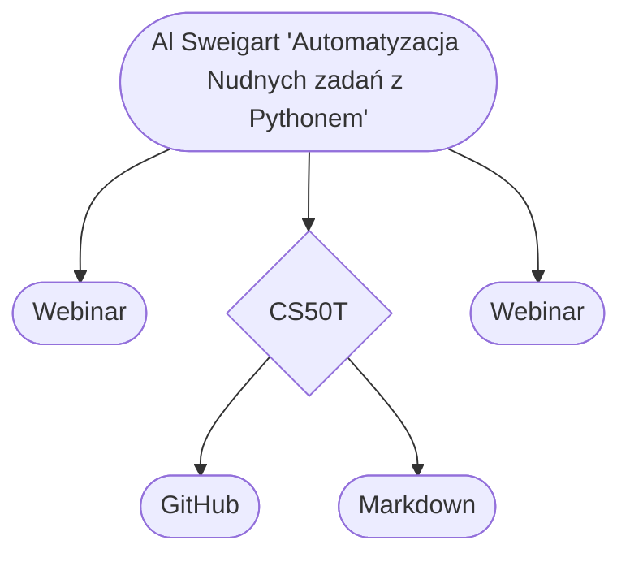
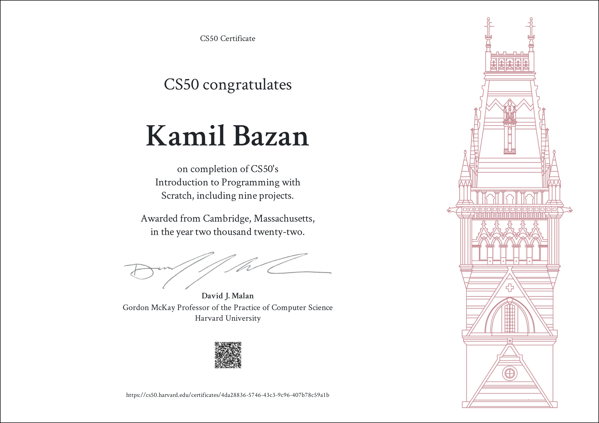
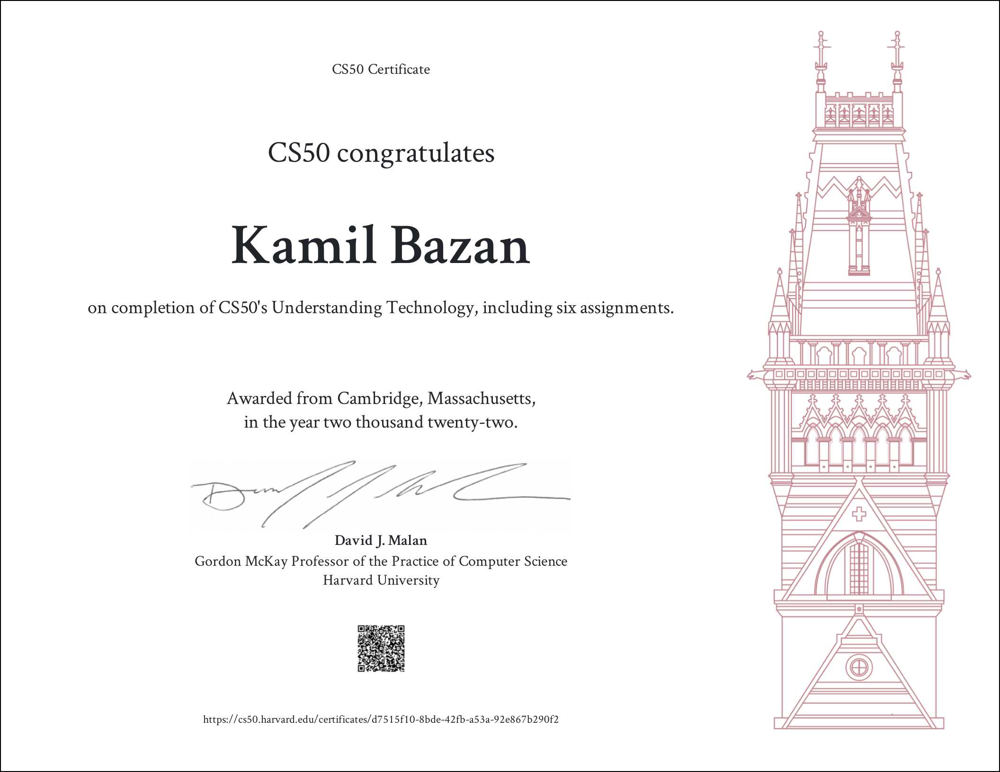
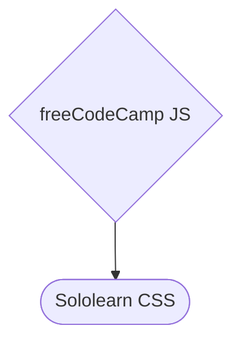
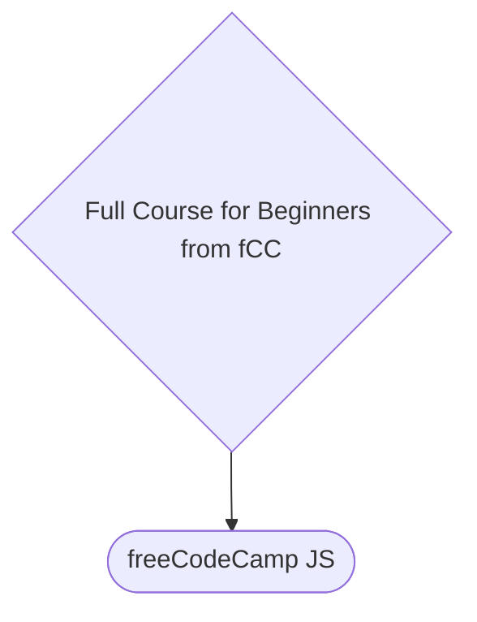
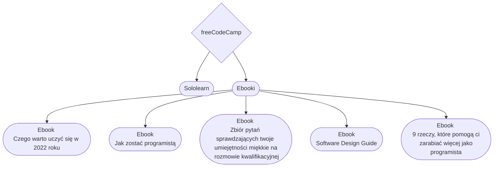
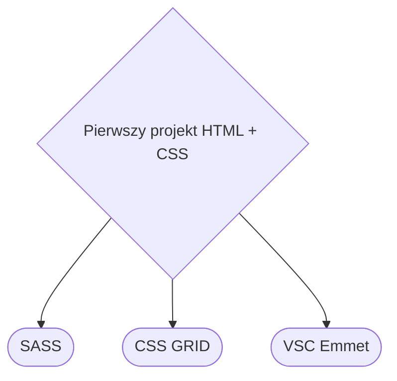

# Moja droga do IT

## **Spis Treści**

WIP

## Wstęp

Cześć! <p>
Mam na imię Kamil, jestem magistrem historii i mam 28 (wkrótce 29) lat. Doświadczyłem w swoim życiu sporo: kiepska praca fizyczna, bez rozwojowe korpo, bezrobocie czy żenująca walka o posadę z najniższą krajową płacą. Kiedy dowiedziałem się, że na ostatnią posadę, na którą składałem CV rywalizować musiałem z około 80 innymi osobami (pracę mógłby wykonywać kompletnie każdy, ale do walki o posadę w szranki stanęło kilkunastu magistrów) podjąłem decyzję o przebranżowieniu.

Studia historyczne, hobby i humanistyczne pasje nie kojarzą się za mocno z programowaniem, jednak uważam, że takie holistyczne przygotowanie dają mi mocny fundament pod nowe życiowe okoliczności.

W tym repozytorium będę dokumentował całą moją drogę do stania się programistą. Uczę się od innych, jednak w nadmiarze informacji łatwo się zgubić, stąd być może moje rozważania i wykarczowana przeze mnie droga pomoże w przyszłości komuś innemu. Czas pokaże.

Per Aspera Ad Astra.

---

### Początki plus pierwszy tydzień

14.07 - 24.07 <p>
Na początku było sporo filmików na YT dlaczego warto zacząć. Po podjęciu decyzji sięgnąłem po książkę Al Sweigarta "Automatyzacja nudnych zadań z Pythonem" ale po około 20% porzuciłem ją- inne rzeczy o wiele bardziej mnie podjarały, ale jeszcze do niej wrócę.\
Później były 2 webinary "jak wejść do IT" i o początkach w .NET. Raczej średnie, ponieważ oba skończyły się próbą sprzedaży bardzo drogich kursów i/lub Bootcampów.\
Tydzień zdominowany głównie przez kurs CS50T- wprowadzenie do IT.
Założyłem też konto na Githubie i stworzyłem własny cheatsheet "Markdown". Spodobało mi się pisanie dokumentacji, więc własna ściąga się przyda.



---

### Drugi tydzień

24.07 - 31.07 <p>
Nowy tydzień zaczęty od konta i aplikacji "Sololearn". Bardzo fajny dodatek- autobus, kolejka u lekarza, brak dostępu do komputera= mała 2min lekcja w apce. Nie jest idealnie, ale wypełnia świetną nisze, czyli "martwe chwile" w których nie masz dostępu do spokojnej nauki w domu przy PC.\
Kolejny wpadł kurs Youtube na obsługę Gita (git add, git commit, git push etc.)\
Ogarnąłem też cały kurs Harvardzki CS50S (Programowanie w Scratch) świetna sprawa na wprowadzenie do programowania.\
Na końcu wpadł mały kursik w Mermaid czyli niejako "dodatku" do Markdown, który pozwala tworzyć takie właśnie drzewka jak w tym dokumencie.\
W ciągu tygodnia ciągle czytałem o technologiach i powtarzającą się radą ciągle było, by zacząć od Frontendu (HTML, CSS, JS) więc na tym będę się skupiał.




---

### Trzeci tydzień

01.08 - 07.08 <p>

Tydzień zdominowany przez freeCodeCamp. Wielu poleca za solidne Curriculum i techniczne podejście do sprawy.\
FreeCodeCamp zaczyna się od bloku "(New) Responsive Web Design" który uczy technologii HTML i CSS. Moim zdaniem świetne podejście twórców: najpierw uczą podając w zasadzie pełne rozwiązanie, za drugim razem dają wskazówkę, a za kolejnymi podają polecenie, a uczący już sam musi dojść do rozwiązania.
Webinary- wpadły kolejne trzy na żywo i od polskich twórców. Niestety realnie przydatnych informacji już nie uświadczyłem. Każdy zachwalał akurat tę technologię, w której miał do sprzedania kurs, do tego za każdym razem używany był wątpliwy moralnie sposób sprzedaży: kurs warty 20tyś, obniżam wam do 6tyś a dodatkowo przez kolejne 45minut sprzedam wam go za 3tyś. Nie lubię takiego marketingu. Ogólnie były to ostatnie webinary: razem od początku nauki zaliczyłem ich pięć, czasowo około 1,5h na każdy, więc 7,5h spędzone na webinarach. Jedyny plus, że w trakcie webinarów posprzątałem sobie pokój i uporządkowałem inne sprawy, czy warto? Zdecydowanie nie.\
Ciągle mam zagwozdkę odnośnie ilości nauki na dzień. Na tą chwilę uczę się dziennie po 3-4h, 6 dni w tygodniu co daje średnio 20h tygodniowo. Sądzę że jest to na granicy wytrzymałości, gdybym dodał te kilka godzin tygodniowo pewnie ryzykuję wypaleniem. Zostanę więc przy tym.\
Ach jeszcze jedna sprawa: uczenie się w blokach. Lepiej jest mieć 2 bloki po 2h, lub 3 bloki (2h, 1h, 1h) niż w kawałku, i zdrowsze i informacje lepiej wchodzą.




---

### Czwarty tydzień

8.08 - 14.08

W tym tygodniu głównie skupiam się na kursie CS50x. Pierwsze lekcje kładą duży nacisk na myślenie programistyczne (problem-solving, pseudocode etc.) Poza teorią z praktyki implementowany jest w pierwszym tygodniu Scratch (aplikacja do nauki programowania wydana przez MiT) a od drugiego tygodnia "C" Trochę archaiczny język, ale syntax nie odbiega za bardzo od np. Pythona. Zadania domowe nie są łatwe, ale terminal wyrzuca błędy wraz z podpowiedzią, gdzie błąd się znajduje- jest więc dobrze. Na spokojnie z notatkami ogarnąłem tydzień 0 i tydzień 1 cały wraz z zadaniami. Z 2 tygodnia zostały mi jedynie zadania do zrobienia.\
Dla urozmaicenia potrenowałem też flexbox z CSS, rozwiązałem wszystkie zadania w "flexbox froggy" i bawiłem się DevToolsem na różnych stronach, nie mogę powiedzieć, że wszystko rozumiem, ale czuję się z tym coraz swobodniej.\
Ogarnąłem jeszcze jeden mały tutorial podstaw HTML i CSS- 95% było mi znane i zrozumiałe, więc jeszcze kilka małych projektów i będę czuł się z tym swobodnie.\
W tym tygodniu wpadłem także na "The Odin Project" i oglądając ichniejsze "Curriculum" bardzo dobra wydaje się pierwsza część całego projektu, czyli "Foundations" nie chce się za bardzo rozdrabniać, jednak wygląda bardzo kusząco, czas pokaże, czy dołączę i to do materiałów mojej nauki.


---

### Piąty tydzień

15.08 - 21.08

Ten tydzień zaczynam od powtórzenia materiału- głównie kod HTML, który nie sprawia mi już wielu kłopotów, jednak podczas zadań na freeCodeCamp czasami miałem pewne problemy. Do tego drobnostki, typu "dobór kolorów" do CSS i responsywność na różnych urządzeniach. Ten tydzień będzie składał się głównie z freeCodeCamp, będę dążył do ukończenia pierwszego kursu "Responsive web design"
Ważna sprawa: nie da się uczyć nowych rzeczy bez końca, ale praktykować można całymi godzinami. To tak jakby uczyć się nowego języka. Nauczenie się 3 tysięcy słów w jeden dzień mija się z celem, ale ćwiczyć rozmówki w obcym języku można cały dzień. Kiedy ilość nowych informacji jest przytłaczająca- trenuj. Wejdź na jakąś stronę w internecie i spróbuj ją odtworzyć w HTML i CSS. Wejdź w "dev-tools" i szperaj, podglądaj, ucz się dobrych praktyk.
Dopracowuje flexboxa, pracuje nad position:absolute.
Dobra porada: kiedy uczysz się HTML czy CSS i wchodzi jakieś nowe zagadnienie (flexbox, grid, selektory, position, variable etc.) wtedy poszukaj dodatkowego małego tutoriala na ten temat na YT (taki około 20min) i doucz się tej jednej konkretnej rzeczy. Mi pomaga!
Tydzień kończę mając za sobą 75% kursu "(New) Responsive Web Design" Zostało mi dopracowanie kilku koncepcji i praktyka. W kolejnym tygodniu skupię się na uporządkowaniu materiałów i odsianiu plew od ziarna.
Trochę też zwolniłem tempo nauki nowych koncepcji na rzecz większej ilości powtórek. Nauka przy 38 stopniach bez klimatyzacji nie jest łatwa.


---

### Szósty tydzień

22.08 - 28.08

Tydzień porządkowania nauki. Po miesiącu nauki widzę już jaśniej co warto, a czego nie warto się uczyć. Od teraz więcej praktyki, mniej teorii, celem jest także zamiana wielu godzin niby-nauki, na mniej godzin, ale za to "głębokiej pracy".
Kolejne powtórki HTML i CSS (flexbox, grid, position, variable, pseudoklasy, selektory)
Celem jest uczyć się każdego dnia po 4h. Nie miałem od początku żadnych wytycznych, więc uczyłem się pomiędzy 2 a 6 godzin dziennie (kilka razy 0) Myślę, że to unormuje moją naukę.
Jak widać na wykresie głównie skupiam się na freeCodeCamp i na powtórkach poszczególnych działów HTML i CSS. Od następnego tygodnia chcę zacząć Javascript, więc robię mocne podsumowanie.
Ostatni projekt freeCodeCampu z części o HTML i CSS to zrobienie własnego Portfolio. Nie jestem w 100% zadowolony, ale jest to świetna baza, do której mam zamiar wracać, szlifować, dopracowywać. Tam w przyszłości będą moje projekty, więc każdemu polecam zapisanie kodu w VSC i dopieszczenie go, ile się tylko da. Sam tak będę robił.
Następny tydzień: JavaScript!


---

### Siódmy tydzień

29.08 - 04.09

Javascript kurs wprowadzający z freeCodeCamp. Jako, że całą naukę zaczynałem od Pythona, podstawy tutaj są niemal identyczne, różni się jedynie syntax. Variable, functions, arrays, Booleans, if statements, switch statements. Chcę porządnie zrozumieć podstawy, więc sporo powtórzeń i ćwiczeń w VSC.
W wolnym czasie na telefonie czy też dla "relaksu" powtarzam sobie na sololearn to co już znam z freeCodeCamp. Niby podstawy, ale sporo dodatkowych informacji można tam znaleźć, więc bardzo polecam. W tym tygodniu udało mi się ukończyć drugi kurs Sololearn, tym razem z CSS. Zacząłem kolejny-JavaScript




---

### Ósmy tydzień

05.09 - 11.09

Javascript. Na freeCodeCamp oraz równolegle na Sololearn (kiedy nie mogę być przy komputerze- idealne połączenie). Każdą funkcję wielokrotnie rozkładam na części pierwsze, powtarzam syntax, żeby "weszło w krew". \
Założyłem też konto na StackOverflow (przez Githuba) i w wolnych chwilach przeglądam z czym ludzie mają największe problemy, czytam więc na co zwracać uwagę.
Trzeci raz przechodzę przez pętle (for i while) pierwszy raz w Pythonie, drugi w C (pierwszy tydzień na CS50x) a teraz w Javascript. I nadal miewam problemy. Dużo przykładać się muszę do syntaxu- nawiasy, przecinki, średniki, kropki- z logiką jest całkiem nieźle, ale czasem przez brak średnika tracę sporo czasu.
W tym tygodniu poświęciłem też troszkę czasu na wprowadzenie do webdesign- czcionki, kolory, rozmiary i responsywność. Jeszcze muszę pogrzebać w temacie, ale niby proste koncepty a jeszcze wiele zostało do nauki.
Skończyłem "Basic JavaScript" na freeCodeCamp. Dla uporządkowania w kolejnym tygodniu zobaczę kilka kursów na YT, żeby usystematyzować wiedzę. Na wykończeniu jest też kurs z podstaw Javascript na Sololearn. Tydzień ten był trudny, sporo nowych koncepcji, troszkę ciężkich chwil i momentów, w których czułem, że "utknąłem" Ale nie spodziewałem się niczego innego, więc mentalnie jest dobrze. Kolejny tydzień powtórki, systematyzowanie i coraz głębiej w Javascript!


---

### Dziewiąty tydzień

12.09 - 18.09

Javascript. Weszły trudniejsze zagadnienia: recursion wraz z praktycznym użyciem; trochę głębiej w Data Structures wchodzę, arrow function, "high order array methods" sporo kombinowania. Jeden dzień nauki zszedł mi prawie w całości na porządkowanie notatek, źródeł, ebooków i wszystkich treści z których miałem zamiar się uczyć. Wyrzuciłem wiele "fluffu".
Twitter ludzi z branży to bardzo ciekawe źródło informacji. Mnóstwo "cheatsheetów" źródeł nauki, porad co do szukania pracy, czy linków do dobrych repozytoriów. Warto założyć konto i od czasu do czasu podejrzeć innych developerów.
Dla powtórzenia przeglądam dokumentacje na MDn Web Docs- czyli oficjalną dokumentację HTML, CSS i JS, co jest trudniejsze od fCC czy kursów, ale fakt, że coraz więcej rozumiem dodaje motywacji. Wszedł też na rozluźnienie kurs od Traversy Media- "JavaScript Crash Course For Beginners" około 80% już znałem, a reszta nie była taka straszna, więc jeszcze trochę i będę na solidnym początkującym poziomie Javascript.


---

### Dziesiąty tydzień

19.09 - 25.09

Coraz głębiej w Javascript. W tym tygodniu skupiam się na ES6, głównie nadal bazuję na freeCodeCamp, ale jeśli jakieś zagadnienie jest bardziej skomplikowane, szukam artykułów, czytam dokumentację i oglądam kursy na YT. Do tej pory jedynie "Recursion" sprawiła mi większy problem, ale powoli wszystko układa się w mojej głowie.
W tym tygodniu także 3 dni niezaplanowanej przerwy. Grypa lub inna choroba dała się mocno we znaki, nie byłem w stanie uczyć się, czy praktykować. Obejrzałem kilka lekkich filmików o programowaniu, czasem tak też bywa. W ostatni z tych trzech dni starczyło sił jedynie na przeczytanie własnych notatek, i trochę powtórek.
Poczytałem dokumentację na przerobione już tematy, o funkcjach, metodach, "math.functions", "template literal" etc. Po kursach i fCC większość była znajoma.


---

### Jedenasty tydzień

26.09 - 02.10

Ostatnie kilka dni przez chorobę nie potrafiłem się uczyć. Tydzień więc zaczynam od powtórek. Kurs od podstaw Javascript utwierdził mnie, że nauka idzie dobrze. Dwa dni powtórek, żeby wrócić do siodła i ruszamy z nowym materiałem. Kursy, artykuły i fCC nadal przodują, jednak coraz więcej uczę się z dokumentacji, ponoć jest to dobra praktyka, stąd cieszy mnie taki obrót spraw. Nadal zagłębiam ES6, (rest parameters, spread operator, shallow/deep copy etc.) Podomykam jeszcze kilka wątków i będzie czas na jakiś większy projekt.
Kolejne zagadnienia: destructuring, classy, getters, setters etc. Nadal problemy sprawia mi recursion, napisałem już kilka prostych funkcji z wykorzystaniem tej metody, muszę nad tym popracować.



---

### Dwunasty tydzień

03.10 - 09.10

W tym tygodniu dużo czytania. Kilka ebooków przeczytałem, troszkę ciekawych informacji wpadło. Najlepszy ebook po angielsku "ArjanCodes „Software Design Guide” daje dużo dobrych porad co do planowania projektów- więc muszę więcej zagłębić się w temat "Software Design" bo to na prawdę ciekawa i wydaje się ważna sprawa. Do tego nadal kolejne funkcje Javascript, głównie te wprowadzone przez ES6. Wróciłem też do CS50. Wpadły też dwa dni gospodarcze, więc musiałem odpuścić trochę naukę, posłuchałem jedynie lekkich wykładów- pogadanek o programowaniu, byle w ciągu dnia choć przez chwilę "pobyć" w świecie programowania. Z wymienionych ebooków polecam jedynie "ArjanCodes „Software Design Guide” oraz ebook Kamila Brzezińskiego „Jak zostać programistą” reszta "meh".



---

### Trzynasty tydzień

10.10 - 16.10

JS, Sololearn. W tym tygodniu ćwiczyłem "JavaScript Higher Order Functions & Arrays" czyli .map, .sort. some. every. reduce. .filter etc. Pozostały czas spędziłem na planowaniu i projektowaniu jakiegoś większego projektu. Kolejny tydzień spędzę na powtórkach, ponieważ będę miał mniej czasu. 15 tydzień to będzie tydzień nowego projektu.
Coraz lepiej idzie mi w manipulowaniu wartościami, coś co miesiąc temu było "czarną magią" teraz rozumiem "instynktownie" Jeszcze dużo jest do nauki, i coraz więcej pochylam się nad samym wykombinowaniem co i jak ma działać (jak powinno być zaprojektowane) i widzę, że samo pisanie kodu, czyli wdrażanie tego projektu jest na drugim miejscu. Zobaczymy, czy mam racje, kiedy będę budował własne projekty.


---

### Czternasty tydzień

17.10 - 23.10

Skupiam się w tym tygodniu na designie- jak planować projekty, jak je rozpisywać na mniejsze zadania etc. W tym tygodniu też sporo innej pracy, więc uczyć będę się mniej- może i przyda mi się trochę odpoczynku.
Z teorii doszło Set i Map wraz z metodami i nauka kiedy się przydają. Wieczorami jedynie słuchałem podcastów o programowaniu, bo nie miałem sił na naukę. Planowałem jedynie kolejne kroki w nauce i rozpisywałem sobie projekty do zrobienia. Zawsze coś. Ogólnie tydzień w programowaniu bierny- za to narąbałem drewna na opał i zrzuciłem do piwnicy 3 tony węgla :)


---

### Piętnasty tydzień

24.10 - 30.10

Mimo jesiennej chandry nowy tydzień rozpoczynam z świeżą głową. Wkułem sobie do głowy to, co o sukcesie powiedział pewien YouTuber: "Sukces zawdzięczam brutalnej systematyczności" niech więc taka będzie moja nauka. Sporo teorii pochłaniam, ale chcę poznać działanie każdego etapu programowania, w taki sposób łatwiej mi się zabrać za pracę. Dodatkowo po setkach godzin wykładów, kursów i olbrzymiej ilości przeczytanych tekstów pierwszy raz ktoś polecił, żeby... czytać kod innych ludzi i zastanawiać się co on robi- wydaje się tak oczywiste! /n
Uczyłem się też obsługi terminalu (Git Bash) ponoć podstawy zawsze się przydają. /n
Końcówkę tygodnia spędzam na przypominaniu sobie HTML i CSS- mam zamiar robić o wiele więcej projektów stron, i stopniowo dodawać do nich coraz to więcej dodatkowych funkcji.
Dokończyłem także kurs Sololearn z Javascript- podstawy już ogarniam dość dobrze, teraz muszę ćwiczyć implementację do projektów.


---

### Szesnasty tydzień

31.10 - 06.11

Powtórki HTML i CSS. Kiedy sobie wszystko odświeżę przejdę do robienia projektów. Zaangażowałem się też w grupę programistów, planujemy jakieś wspólne projekty- zobaczymy, czy słomiany zapał, czy coś jednak z tego wyjdzie. W środę zakończyłem powtórkę HTML, od czwartku wchodzi CSS. Powtórkę HTML miałem w formie 4h kursu YT- porobiłem trochę prostych stronek, poczytałem o semantycznym HTML, przypomniałem sobie co i jak. Przy CSS przypominanie idzie szybko, ale już widzę, że trzeba będzie dużo praktyki. Własne projekty- to chyba najlepszy sposób nauki na tym etapie.


---

### Siedemnasty tydzień

07.11 - 13.11

Dalszy ciąg powtórek, tym razem kurs CSS. Ułożyłem przy okazji swój dzień, więc mam na programowanie więcej czasu, wpadło kilka pomniejszych projektów i planuje już pierwsze własne od podstaw. Dogłębniej zanurzyłem się w BEM i chcę lepszego zrozumienia CSS. Uczę się też w jakiej kolejności modyfikować kod i dużo oglądam jak inni kodują, żeby podpatrzeć proces. Raz jeszcze przypomniałem sobie flexbox i grid, a podczas nauki więcej używam "Emmet" którego uczę się z dokumentacji.


---

### Osiemnasty tydzień

14.11 - 20.11

W tym tygodniu skupiam się na designie. Kolory i kontrast, rozmieszczenie na stronie, skala, typografia etc. Do tego zająłem się dogłębnym planowaniem projektu i samego procesu projektowania- w tym wypadku strony. Sporo szkicowania na kartkach, rozmieszczania elementów itd. Niby mógłbym w tym miejscu nauczyć się już np. Figmy, jednak chcę dogłębnie poznać wpierw Vanilla CSS. W końcu zacząłem budowę pierwszej strony- rozrysowana na kartce, implementowana w HTML z naciskiem na semantyczny HTML z użyciem Variables, BEM i Flexboxa. Masa powtórek, ale powoli się wszystko układa, muszę więcej pokazywać kod do oceny, zauważyłem, że jeśli ktoś ma zobaczyć mój kod, automatycznie staram się lepiej go pisać.


---

### Dziewiętnasty tydzień

21.11 - 27.11

Pierwszy projekt zrobiony, mocno kulawy, do poprawy wiele rzeczy, ale jest. Już wiem, że to nie bułka z masłem, a ciężka praca i trzeba się dobrze nakombinować, ale teraz już mam cel, żeby kolejny projekt był lepszy. Wewnątrz grupy z którą uczę się programować wyrasta pomysł robienia makiet stron i wspólnego ich oceniania, co ma potencjał na rozrościęcie się do skali wspólnych projektów. Sam powtarzam sobie CSS GRID, liznąłem także SASS i nauczyłem się korzystania z Emmeta.



---

### Dwudziesty tydzień

28.11 - 04.12

Większość czasu na naukę spędziłem na grupowym projekcie- myślę, że statyczną stronę jestem w stanie odwzorować w 90%, reszta to już detale (projekt był na mniejszą rozdzielczość, ikony nie miały funkcjonalności etc.) W kolejnym tygodniu będę szlifował projekt, oraz zajmę się responsywnością. Projekt wygląda piękne... statycznie, jednak każde zmniejszenie okienka zamienia piękną księżniczkę w szkaradną ropuchę- czas przypomnieć sobie i poduczyć się responsywności. Na tym też kończę tydzień- media query i responsywność.


---

### Dwudziesty pierwszy tydzień

05.12 - 11.12

SASS a właściwie SCSS- uczę się podstaw, w kolejnym projekcie chcę wytestować SASS wraz z GRIDem, który w tym tygodniu sobie będę przypominał. Kończę też grupowy projekt z discorda, nie wszystko wyszło idealnie, ale wiele się nauczyłem. Tydzień kończę nauką dobrej organizacji plików w projekcie.

```mermaid
flowchart
A{}-->B([])
```

(In progress)
X tydzień- tydzień powtórek: HTML, CSS, responsywność, inspiracje, sololearn, przeczytać własne notatki
X tydzień- spory projekt: portfolio HTML, CSS, JS
X tydzień linkedin, CV, GitHub
X tydzień CS50 week 2 plus week 3
(In progress)
