# Moja droga do IT

## **Spis Treści**

WIP

## Wstęp

Cześć! <p>
Mam na imię Kamil, jestem magistrem historii i mam 28 (wkrótce 29) lat. Doświadczyłem w swoim życiu sporo: kiepska praca fizyczna, bez rozwojowe korpo, bezrobocie czy żenująca walka o posadę z najniższą krajową płacą. Kiedy dowiedziałem się, że na ostatnią posadę, na którą składałem CV rywalizować musiałem z około 80 innymi osobami (pracę mógłby wykonywać kompletnie każdy, ale do walki o posadę w szranki stanęło kilkunastu magistrów) podjąłem decyzję o przebranżowieniu.

Studia historyczne, hobby i humanistyczne pasje nie kojarzą się za mocno z programowaniem, jednak uważam, że takie holistyczne przygotowanie dają mi mocny fundament pod nowe życiowe okoliczności.

W tym repozytorium będę dokumentował całą moją drogę do stania się programistą. Uczę się od innych, jednak w nadmiarze informacji łatwo się zgubić, stąd być może moje rozważania i wykarczowana przeze mnie droga pomoże w przyszłości komuś innemu. Czas pokaże.

Per Aspera Ad Astra.

---

### Początki plus pierwszy tydzień

14.07 - 24.07 <p>
Na początku było sporo filmików na YT dlaczego warto zacząć. Po podjęciu decyzji sięgnąłem po książkę Al Sweigarta "Automatyzacja nudnych zadań z Pythonem" ale po około 20% porzuciłem ją- inne rzeczy o wiele bardziej mnie podjarały, ale jeszcze do niej wrócę.\
Później były 2 webinary "jak wejść do IT" i o początkach w .NET. Raczej średnie, ponieważ oba skończyły się próbą sprzedaży bardzo drogich kursów i/lub Bootcampów.\
Tydzień zdominowany głównie przez kurs CS50T- wprowadzenie do IT.
Założyłem też konto na Githubie i stworzyłem własny cheatsheet "Markdown". Spodobało mi się pisanie dokumentacji, więc własna ściąga się przyda.


---

### Drugi tydzień

24.07 - 31.07 <p>
Nowy tydzień zaczęty od konta i aplikacji "Sololearn". Bardzo fajny dodatek- autobus, kolejka u lekarza, brak dostępu do komputera= mała 2min lekcja w apce. Nie jest idealnie, ale wypełnia świetną nisze, czyli "martwe chwile" w których nie masz dostępu do spokojnej nauki w domu przy PC.\
Kolejny wpadł kurs Youtube na obsługę Gita (git add, git commit, git push etc.)\
Ogarnąłem też cały kurs Harvardzki CS50S (Programowanie w Scratch) świetna sprawa na wprowadzenie do programowania.\
Na końcu wpadł mały kursik w Mermaid czyli niejako "dodatku" do Markdown, który pozwala tworzyć takie właśnie drzewka jak w tym dokumencie.\
W ciągu tygodnia ciągle czytałem o technologiach i powtarzającą się radą ciągle było, by zacząć od Frontendu (HTML, CSS, JS) więc na tym będę się skupiał.


---

### Trzeci tydzień

01.08 - 07.08 <p>

Tydzień zdominowany przez freeCodeCamp. Wielu poleca za solidne Curriculum i techniczne podejście do sprawy.\
FreeCodeCamp zaczyna się od bloku "(New) Responsive Web Design" który uczy technologii HTML i CSS. Moim zdaniem świetne podejście twórców: najpierw uczą podając w zasadzie pełne rozwiązanie, za drugim razem dają wskazówkę, a za kolejnymi podają polecenie, a uczący już sam musi dojść do rozwiązania.
Webinary- wpadły kolejne trzy na żywo i od polskich twórców. Niestety realnie przydatnych informacji już nie uświadczyłem. Każdy zachwalał akurat tę technologię, w której miał do sprzedania kurs, do tego za każdym razem używany był wątpliwy moralnie sposób sprzedaży: kurs warty 20tyś, obniżam wam do 6tyś a dodatkowo przez kolejne 45minut sprzedam wam go za 3tyś. Nie lubię takiego marketingu. Ogólnie były to ostatnie webinary: razem od początku nauki zaliczyłem ich pięć, czasowo około 1,5h na każdy, więc 7,5h spędzone na webinarach. Jedyny plus, że w trakcie webinarów posprzątałem sobie pokój i uporządkowałem inne sprawy, czy warto? Zdecydowanie nie.\
Ciągle mam zagwozdkę odnośnie ilości nauki na dzień. Na tą chwilę uczę się dziennie po 3-4h, 6 dni w tygodniu co daje średnio 20h tygodniowo. Sądzę że jest to na granicy wytrzymałości, gdybym dodał te kilka godzin tygodniowo pewnie ryzykuję wypaleniem. Zostanę więc przy tym.\
Ach jeszcze jedna sprawa: uczenie się w blokach. Lepiej jest mieć 2 bloki po 2h, lub 3 bloki (2h, 1h, 1h) niż w kawałku, i zdrowsze i informacje lepiej wchodzą.


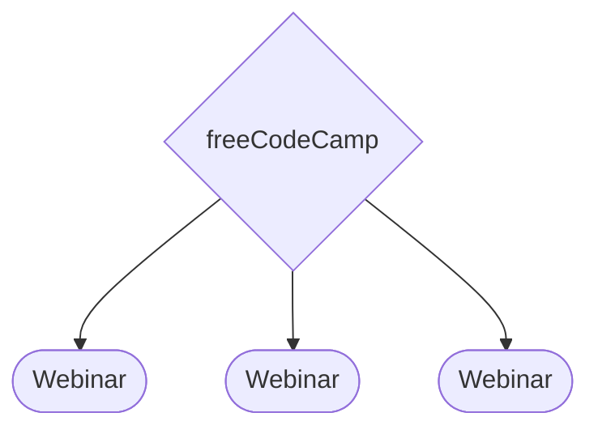

---

### Czwarty tydzień

8.08 - 14.08

W tym tygodniu głównie skupiam się na kursie CS50x. Pierwsze lekcje kładą duży nacisk na myślenie programistyczne (problem-solving, pseudocode etc.) Poza teorią z praktyki implementowany jest w pierwszym tygodniu Scratch (aplikacja do nauki programowania wydana przez MiT) a od drugiego tygodnia "C" Trochę archaiczny język, ale syntax nie odbiega za bardzo od np. Pythona. Zadania domowe nie są łatwe, ale terminal wyrzuca błędy wraz z podpowiedzią, gdzie błąd się znajduje- jest więc dobrze. Na spokojnie z notatkami ogarnąłem tydzień 0 i tydzień 1 cały wraz z zadaniami. Z 2 tygodnia zostały mi jedynie zadania do zrobienia.\
Dla urozmaicenia potrenowałem też flexbox z CSS, rozwiązałem wszystkie zadania w "flexbox froggy" i bawiłem się DevToolsem na różnych stronach, nie mogę powiedzieć, że wszystko rozumiem, ale czuję się z tym coraz swobodniej.\
Ogarnąłem jeszcze jeden mały tutorial podstaw HTML i CSS- 95% było mi znane i zrozumiałe, więc jeszcze kilka małych projektów i będę czuł się z tym swobodnie.\
W tym tygodniu wpadłem także na "The Odin Project" i oglądając ichniejsze "Curriculum" bardzo dobra wydaje się pierwsza część całego projektu, czyli "Foundations" nie chce się za bardzo rozdrabniać, jednak wygląda bardzo kusząco, czas pokaże, czy dołączę i to do materiałów mojej nauki.

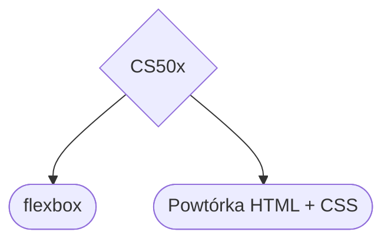

---

### Piąty tydzień

15.08 - 21.08

Ten tydzień zaczynam od powtórzenia materiału- głównie kod HTML, który nie sprawia mi już wielu kłopotów, jednak podczas zadań na freeCodeCamp czasami miałem pewne problemy. Do tego drobnostki, typu "dobór kolorów" do CSS i responsywność na różnych urządzeniach. Ten tydzień będzie składał się głównie z freeCodeCamp, będę dążył do ukończenia pierwszego kursu "Responsive web design"
Ważna sprawa: nie da się uczyć nowych rzeczy bez końca, ale praktykować można całymi godzinami. To tak jakby uczyć się nowego języka. Nauczenie się 3 tysięcy słów w jeden dzień mija się z celem, ale ćwiczyć rozmówki w obcym języku można cały dzień. Kiedy ilość nowych informacji jest przytłaczająca- trenuj. Wejdź na jakąś stronę w internecie i spróbuj ją odtworzyć w HTML i CSS. Wejdź w "dev-tools" i szperaj, podglądaj, ucz się dobrych praktyk.
Dopracowuje flexboxa, pracuje nad position:absolute.
Dobra porada: kiedy uczysz się HTML czy CSS i wchodzi jakieś nowe zagadnienie (flexbox, grid, selektory, position, variable etc.) wtedy poszukaj dodatkowego małego tutoriala na ten temat na YT (taki około 20min) i doucz się tej jednej konkretnej rzeczy. Mi pomaga!
Tydzień kończę mając za sobą 75% kursu "(New) Responsive Web Design" Zostało mi dopracowanie kilku koncepcji i praktyka. W kolejnym tygodniu skupię się na uporządkowaniu materiałów i odsianiu plew od ziarna.
Trochę też zwolniłem tempo nauki nowych koncepcji na rzecz większej ilości powtórek. Nauka przy 38 stopniach bez klimatyzacji nie jest łatwa.


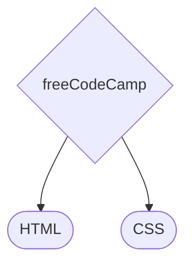

---

### Szósty tydzień

22.08 - 28.08

Tydzień porządkowania nauki. Po miesiącu nauki widzę już jaśniej co warto, a czego nie warto się uczyć. Od teraz więcej praktyki, mniej teorii, celem jest także zamiana wielu godzin niby-nauki, na mniej godzin, ale za to "głębokiej pracy".
Kolejne powtórki HTML i CSS (flexbox, grid, position, variable, pseudoklasy, selektory)
Celem jest uczyć się każdego dnia po 4h. Nie miałem od początku żadnych wytycznych, więc uczyłem się pomiędzy 2 a 6 godzin dziennie (kilka razy 0) Myślę, że to unormuje moją naukę.
Jak widać na wykresie głównie skupiam się na freeCodeCamp i na powtórkach poszczególnych działów HTML i CSS. Od następnego tygodnia chcę zacząć Javascript, więc robię mocne podsumowanie.
Ostatni projekt freeCodeCampu z części o HTML i CSS to zrobienie własnego Portfolio. Nie jestem w 100% zadowolony, ale jest to świetna baza, do której mam zamiar wracać, szlifować, dopracowywać. Tam w przyszłości będą moje projekty, więc każdemu polecam zapisanie kodu w VSC i dopieszczenie go, ile się tylko da. Sam tak będę robił.
Następny tydzień: JavaScript!

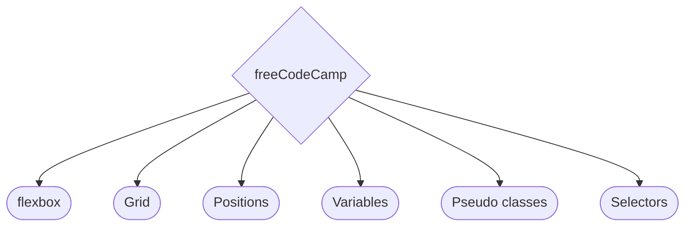


---

### Siódmy tydzień

29.08 - 04.09

Javascript kurs wprowadzający z freeCodeCamp. Jako, że całą naukę zaczynałem od Pythona, podstawy tutaj są niemal identyczne, różni się jedynie syntax. Variable, functions, arrays, Booleans, if statements, switch statements. Chcę porządnie zrozumieć podstawy, więc sporo powtórzeń i ćwiczeń w VSC.
W wolnym czasie na telefonie czy też dla "relaksu" powtarzam sobie na sololearn to co już znam z freeCodeCamp. Niby podstawy, ale sporo dodatkowych informacji można tam znaleźć, więc bardzo polecam. W tym tygodniu udało mi się ukończyć drugi kurs Sololearn, tym razem z CSS. Zacząłem kolejny-JavaScript


---

### Ósmy tydzień

05.09 - 11.09

Javascript. Na freeCodeCamp oraz równolegle na Sololearn (kiedy nie mogę być przy komputerze- idealne połączenie). Każdą funkcję wielokrotnie rozkładam na części pierwsze, powtarzam syntax, żeby "weszło w krew". \
Założyłem też konto na StackOverflow (przez Githuba) i w wolnych chwilach przeglądam z czym ludzie mają największe problemy, czytam więc na co zwracać uwagę.
Trzeci raz przechodzę przez pętle (for i while) pierwszy raz w Pythonie, drugi w C (pierwszy tydzień na CS50x) a teraz w Javascript. I nadal miewam problemy. Dużo przykładać się muszę do syntaxu- nawiasy, przecinki, średniki, kropki- z logiką jest całkiem nieźle, ale czasem przez brak średnika tracę sporo czasu.
W tym tygodniu poświęciłem też troszkę czasu na wprowadzenie do webdesign- czcionki, kolory, rozmiary i responsywność. Jeszcze muszę pogrzebać w temacie, ale niby proste koncepty a jeszcze wiele zostało do nauki.
Skończyłem "Basic JavaScript" na freeCodeCamp. Dla uporządkowania w kolejnym tygodniu zobaczę kilka kursów na YT, żeby usystematyzować wiedzę. Na wykończeniu jest też kurs z podstaw Javascript na Sololearn. Tydzień ten był trudny, sporo nowych koncepcji, troszkę ciężkich chwil i momentów, w których czułem, że "utknąłem" Ale nie spodziewałem się niczego innego, więc mentalnie jest dobrze. Kolejny tydzień powtórki, systematyzowanie i coraz głębiej w Javascript!

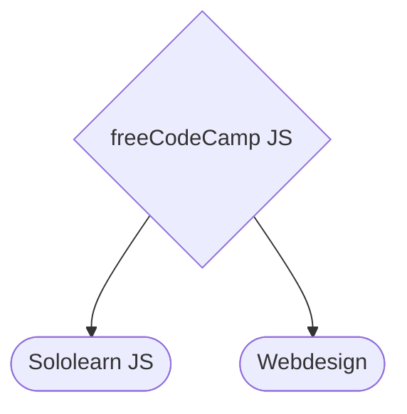

---

### Dziewiąty tydzień

12.09 - 18.09

Javascript. Weszły trudniejsze zagadnienia: recursion wraz z praktycznym użyciem; trochę głębiej w Data Structures wchodzę, arrow function, "high order array methods" sporo kombinowania. Jeden dzień nauki zszedł mi prawie w całości na porządkowanie notatek, źródeł, ebooków i wszystkich treści z których miałem zamiar się uczyć. Wyrzuciłem wiele "fluffu".
Twitter ludzi z branży to bardzo ciekawe źródło informacji. Mnóstwo "cheatsheetów" źródeł nauki, porad co do szukania pracy, czy linków do dobrych repozytoriów. Warto założyć konto i od czasu do czasu podejrzeć innych developerów.
Dla powtórzenia przeglądam dokumentacje na MDn Web Docs- czyli oficjalną dokumentację HTML, CSS i JS, co jest trudniejsze od fCC czy kursów, ale fakt, że coraz więcej rozumiem dodaje motywacji. Wszedł też na rozluźnienie kurs od Traversy Media- "JavaScript Crash Course For Beginners" około 80% już znałem, a reszta nie była taka straszna, więc jeszcze trochę i będę na solidnym początkującym poziomie Javascript.

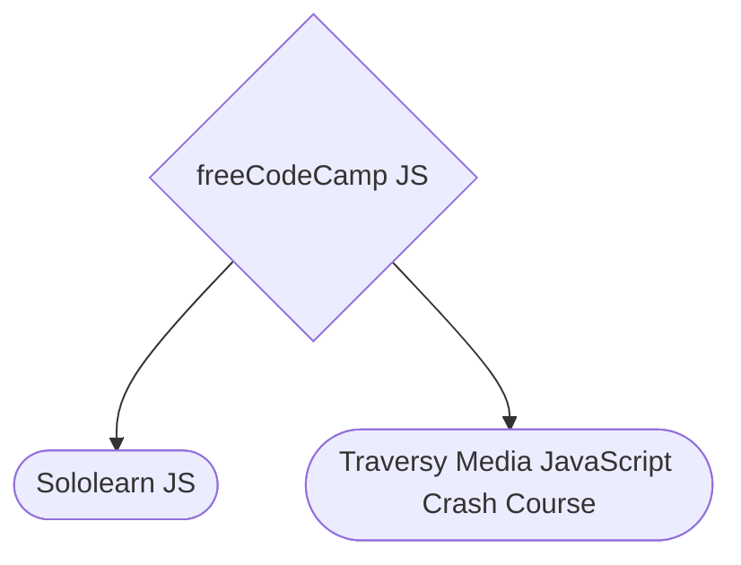

---

### Dziesiąty tydzień

19.09 - 25.09

Coraz głębiej w Javascript. W tym tygodniu skupiam się na ES6, głównie nadal bazuję na freeCodeCamp, ale jeśli jakieś zagadnienie jest bardziej skomplikowane, szukam artykułów, czytam dokumentację i oglądam kursy na YT. Do tej pory jedynie "Recursion" sprawiła mi większy problem, ale powoli wszystko układa się w mojej głowie.
W tym tygodniu także 3 dni niezaplanowanej przerwy. Grypa lub inna choroba dała się mocno we znaki, nie byłem w stanie uczyć się, czy praktykować. Obejrzałem kilka lekkich filmików o programowaniu, czasem tak też bywa. W ostatni z tych trzech dni starczyło sił jedynie na przeczytanie własnych notatek, i trochę powtórek.
Poczytałem dokumentację na przerobione już tematy, o funkcjach, metodach, "math.functions", "template literal" etc. Po kursach i fCC większość była znajoma.

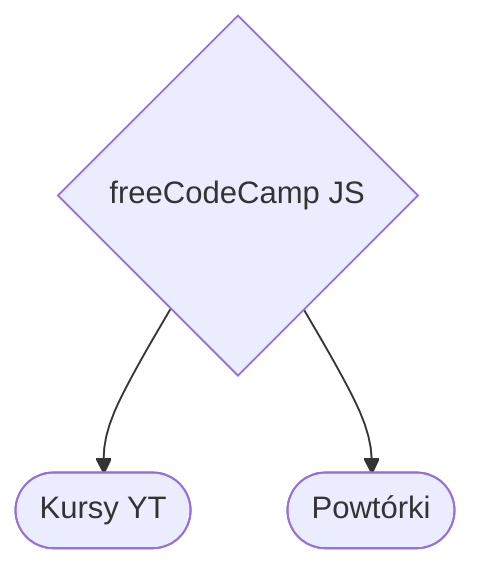

---

### Jedenasty tydzień

26.09 - 02.10

Ostatnie kilka dni przez chorobę nie potrafiłem się uczyć. Tydzień więc zaczynam od powtórek. Kurs od podstaw Javascript utwierdził mnie, że nauka idzie dobrze. Dwa dni powtórek, żeby wrócić do siodła i ruszamy z nowym materiałem. Kursy, artykuły i fCC nadal przodują, jednak coraz więcej uczę się z dokumentacji, ponoć jest to dobra praktyka, stąd cieszy mnie taki obrót spraw. Nadal zagłębiam ES6, (rest parameters, spread operator, shallow/deep copy etc.) Podomykam jeszcze kilka wątków i będzie czas na jakiś większy projekt.
Kolejne zagadnienia: destructuring, classy, getters, setters etc. Nadal problemy sprawia mi recursion, napisałem już kilka prostych funkcji z wykorzystaniem tej metody, muszę nad tym popracować.


---

### Dwunasty tydzień

03.10 - 09.10

W tym tygodniu dużo czytania. Kilka ebooków przeczytałem, troszkę ciekawych informacji wpadło. Najlepszy ebook po angielsku "ArjanCodes „Software Design Guide” daje dużo dobrych porad co do planowania projektów- więc muszę więcej zagłębić się w temat "Software Design" bo to na prawdę ciekawa i wydaje się ważna sprawa. Do tego nadal kolejne funkcje Javascript, głównie te wprowadzone przez ES6. Wróciłem też do CS50. Wpadły też dwa dni gospodarcze, więc musiałem odpuścić trochę naukę, posłuchałem jedynie lekkich wykładów- pogadanek o programowaniu, byle w ciągu dnia choć przez chwilę "pobyć" w świecie programowania. Z wymienionych ebooków polecam jedynie "ArjanCodes „Software Design Guide” oraz ebook Kamila Brzezińskiego „Jak zostać programistą” reszta "meh".


---

### Trzynasty tydzień

10.10 - 16.10

JS, Sololearn. W tym tygodniu ćwiczyłem "JavaScript Higher Order Functions & Arrays" czyli .map, .sort. some. every. reduce. .filter etc. Pozostały czas spędziłem na planowaniu i projektowaniu jakiegoś większego projektu. Kolejny tydzień spędzę na powtórkach, ponieważ będę miał mniej czasu. 15 tydzień to będzie tydzień nowego projektu.
Coraz lepiej idzie mi w manipulowaniu wartościami, coś co miesiąc temu było "czarną magią" teraz rozumiem "instynktownie" Jeszcze dużo jest do nauki, i coraz więcej pochylam się nad samym wykombinowaniem co i jak ma działać (jak powinno być zaprojektowane) i widzę, że samo pisanie kodu, czyli wdrażanie tego projektu jest na drugim miejscu. Zobaczymy, czy mam racje, kiedy będę budował własne projekty.

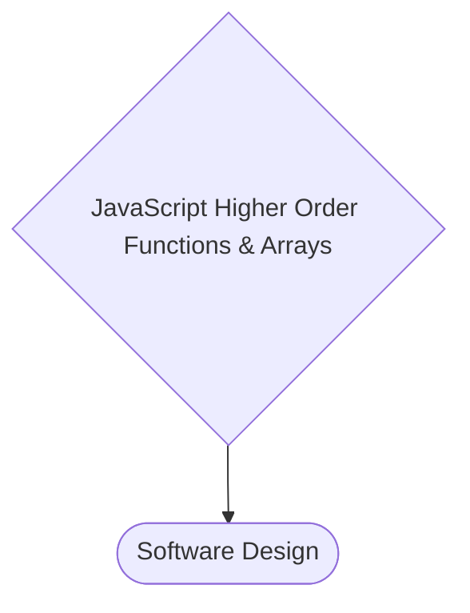

---

### Czternasty tydzień

17.10 - 23.10

Skupiam się w tym tygodniu na designie- jak planować projekty, jak je rozpisywać na mniejsze zadania etc. W tym tygodniu też sporo innej pracy, więc uczyć będę się mniej- może i przyda mi się trochę odpoczynku.
Z teorii doszło Set i Map wraz z metodami i nauka kiedy się przydają. Wieczorami jedynie słuchałem podcastów o programowaniu, bo nie miałem sił na naukę. Planowałem jedynie kolejne kroki w nauce i rozpisywałem sobie projekty do zrobienia. Zawsze coś. Ogólnie tydzień w programowaniu bierny- za to narąbałem drewna na opał i zrzuciłem do piwnicy 3 tony węgla :)

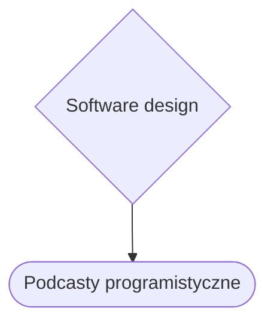

---

### Piętnasty tydzień

24.10 - 30.10

Mimo jesiennej chandry nowy tydzień rozpoczynam z świeżą głową. Wkułem sobie do głowy to, co o sukcesie powiedział pewien YouTuber: "Sukces zawdzięczam brutalnej systematyczności" niech więc taka będzie moja nauka. Sporo teorii pochłaniam, ale chcę poznać działanie każdego etapu programowania, w taki sposób łatwiej mi się zabrać za pracę. Dodatkowo po setkach godzin wykładów, kursów i olbrzymiej ilości przeczytanych tekstów pierwszy raz ktoś polecił, żeby... czytać kod innych ludzi i zastanawiać się co on robi- wydaje się tak oczywiste! /n
Uczyłem się też obsługi terminalu (Git Bash) ponoć podstawy zawsze się przydają. /n
Końcówkę tygodnia spędzam na przypominaniu sobie HTML i CSS- mam zamiar robić o wiele więcej projektów stron, i stopniowo dodawać do nich coraz to więcej dodatkowych funkcji.
Dokończyłem także kurs Sololearn z Javascript- podstawy już ogarniam dość dobrze, teraz muszę ćwiczyć implementację do projektów.


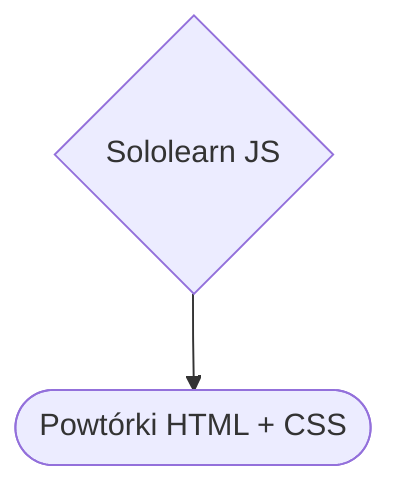

---

### Szesnasty tydzień

31.10 - 06.11

Powtórki HTML i CSS. Kiedy sobie wszystko odświeżę przejdę do robienia projektów. Zaangażowałem się też w grupę programistów, planujemy jakieś wspólne projekty- zobaczymy, czy słomiany zapał, czy coś jednak z tego wyjdzie. W środę zakończyłem powtórkę HTML, od czwartku wchodzi CSS. Powtórkę HTML miałem w formie 4h kursu YT- porobiłem trochę prostych stronek, poczytałem o semantycznym HTML, przypomniałem sobie co i jak. Przy CSS przypominanie idzie szybko, ale już widzę, że trzeba będzie dużo praktyki. Własne projekty- to chyba najlepszy sposób nauki na tym etapie.

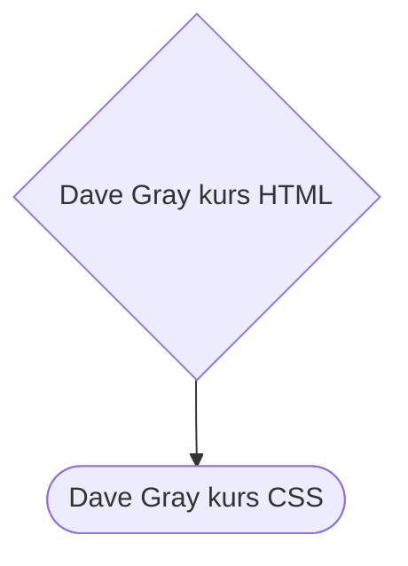

---

### Siedemnasty tydzień

07.11 - 13.11

Dalszy ciąg powtórek, tym razem kurs CSS. Ułożyłem przy okazji swój dzień, więc mam na programowanie więcej czasu, wpadło kilka pomniejszych projektów i planuje już pierwsze własne od podstaw. Dogłębniej zanurzyłem się w BEM i chcę lepszego zrozumienia CSS. Uczę się też w jakiej kolejności modyfikować kod i dużo oglądam jak inni kodują, żeby podpatrzeć proces. Raz jeszcze przypomniałem sobie flexbox i grid, a podczas nauki więcej używam "Emmet" którego uczę się z dokumentacji.

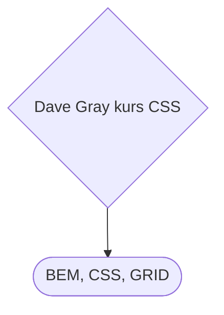

---

### Osiemnasty tydzień

14.11 - 20.11

W tym tygodniu skupiam się na designie. Kolory i kontrast, rozmieszczenie na stronie, skala, typografia etc. Do tego zająłem się dogłębnym planowaniem projektu i samego procesu projektowania- w tym wypadku strony. Sporo szkicowania na kartkach, rozmieszczania elementów itd. Niby mógłbym w tym miejscu nauczyć się już np. Figmy, jednak chcę dogłębnie poznać wpierw Vanilla CSS. W końcu zacząłem budowę pierwszej strony- rozrysowana na kartce, implementowana w HTML z naciskiem na semantyczny HTML z użyciem Variables, BEM i Flexboxa. Masa powtórek, ale powoli się wszystko układa, muszę więcej pokazywać kod do oceny, zauważyłem, że jeśli ktoś ma zobaczyć mój kod, automatycznie staram się lepiej go pisać.

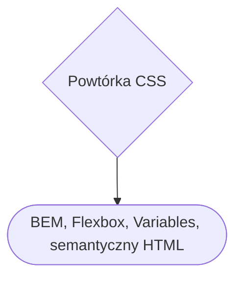

---

### Dziewiętnasty tydzień

21.11 - 27.11

Pierwszy projekt zrobiony, mocno kulawy, do poprawy wiele rzeczy, ale jest. Już wiem, że to nie bułka z masłem, a ciężka praca i trzeba się dobrze nakombinować, ale teraz już mam cel, żeby kolejny projekt był lepszy. Wewnątrz grupy z którą uczę się programować wyrasta pomysł robienia makiet stron i wspólnego ich oceniania, co ma potencjał na rozrościęcie się do skali wspólnych projektów. Sam powtarzam sobie CSS GRID, liznąłem także SASS i nauczyłem się korzystania z Emmeta.


---

### Dwudziesty tydzień

28.11 - 04.12

Większość czasu na naukę spędziłem na grupowym projekcie- myślę, że statyczną stronę jestem w stanie odwzorować w 90%, reszta to już detale (projekt był na mniejszą rozdzielczość, ikony nie miały funkcjonalności etc.) W kolejnym tygodniu będę szlifował projekt, oraz zajmę się responsywnością. Projekt wygląda piękne... statycznie, jednak każde zmniejszenie okienka zamienia piękną księżniczkę w szkaradną ropuchę- czas przypomnieć sobie i poduczyć się responsywności. Na tym też kończę tydzień- media query i responsywność.

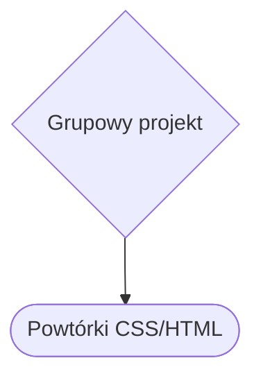

---

### Dwudziesty pierwszy tydzień

05.12 - 11.12

SASS a właściwie SCSS- uczę się podstaw, w kolejnym projekcie chcę wytestować SASS wraz z GRIDem, który w tym tygodniu sobie będę przypominał. Kończę też grupowy projekt z discorda, nie wszystko wyszło idealnie, ale wiele się nauczyłem. Tydzień kończę nauką dobrej organizacji plików w projekcie.

```mermaid
flowchart
A{Grupowy projekt}-->B([Organizacja danych])
```

---

### Dwudziesty drugi tydzień

12.12 - 18.12

Powtórka własnych notatek, następnie SCSS. Dogłębnie powtarzam sobie responsywność oraz związany z nią kod (clamp, calc, ustawianie font-size na 62,5% i używanie remów etc.) Myślę także nad kolejnym projektem, który sprawdzi całą tą wiedzę w praktyce. Wrócił też GRID, wpadają małe tutoriale oraz dokumentacja BEMa.

```mermaid
flowchart
A{SASS}-->B([Responsive Design])
```

---

### Dwudziesty trzeci tydzień

19.12 - 25.12

Powtórka responsywności. Tydzień przed świętami jest więc bardzo ciężko z czasem, wybieram więc mniej zajmujące źródła nauki. Wpadły 4 ebooki, dwa na takim poziomie, że szkoda wspominać, jednak dwa pozostałe dość dobre.
Pierwszy: Andy Sterkowitz „Self-Taught programmer study manual” : dobry krótki poradnik o organizacji czasu, potrzebie ciągłego redefiniowania swoich celów oraz skupiania się na projektach oraz odzewie od innych. Czyli samemu pisać dużo kodu i pokazywać go na prawo i lewo, tak, by zebrać jak najwięcej opinii.
Drugi: Mateusz Kupilas "Junior Developer" : O dziwo bardzo dobra książka. Do przeczytania w 2-3h, opisuje w bardzo dobry sposób roces nauki, czy organizację pracy. Bardzo polecam, to nie była strata czasu!

```mermaid
flowchart
A{Ebooki}-->B([Ebook:Junior Developer])
A{Ebooki}-->C([Ebook:Self-Taught programmer study manual])
```

---

### Dwudziesty czwarty tydzień

26.12 - 01.01

Święta i odwiedziny rodziny, przez co wpadła najdłuższa od początku nauki przerwa: 5 dni! Powrót był dziwny, ale teraz jestem pewien, że lepiej by było gdybym każdego dnia poświęcił chociaż 15min na jakiś mały artykuł. 5 dni robi różnicę, ale już wracam w siodło: na pierwszy tydzień stycznia planuje projekt z Gridem, flexboxem, SASSem i BEMem. Znalazłem też dobrą stronę "Frontend Mentor" gdzie są konkretne projekty do zrobienia- od stycznia w ramach nauki będę je robił. GRID powtórzony, można zrelaksować się na sylwestra i od nowego roku ruszyć z nową motywacją.

```mermaid
flowchart
A{GRID}-->B([Frontend Mentor])
```

---

### Dwudziesty piąty tydzień

02.01 - 08.01

W tym tygodniu projektowo powtarzam podstawy, chcę zakończyć kilka mini-projektów zanim przejdę do powtórki JS. Zrobiłem 2 podstawowe projekty z Frontend Mentora, szkoda, że wcześniej nie wiedziałem o istnieniu tej strony. Zaplanowany mam remont, więc może wpaść niespodziewana przerwa, postaram się codziennie przynajmniej chwilę przysiąść przed kodem. Dziś powtarzałem JS, zagłębiam się we własne notatki, oraz tutorial na YT, jeśli szybko powtórzę materiał zrobię 2 projekty z JS i według ludzi z discorda dobrze już zacząć Typescripta i Reacta na tym etapie- zobaczę jak wyjdzie w praktyce. Powtórka JS weszła mocno, lecę z własnymi notatkami, za chwilę będę wchodził w projekty, hamuje mnie jedynie remont, ale od nowego tygodnie przyspieszę. Znowu się rajcuję nauką- jest w pytkę. Pod koniec tygodnia przypomniałem sobie o Harvardzkim kursie CS50x, postanowiłem oglądać w niedzielę wykłady oraz "shorty" żeby dogłębniej poznać ogólne zagadnienia programowania i odpocząć od całym tygodniu praktyki. Harvardzki wykład "dla relaksu" kto by pomyślał...

```mermaid
flowchart
A{Javascript}-->B([CS50x])
```

---

### Dwudziesty szósty tydzień

09.01 - 15.01

Dalej JS. Mam zamiar przerobić cały materiał od początku, podstawowe koncepcje, a nawet zaawansowane sposoby manipulacji danymi są przeze mnie bardzo dobrze zrozumiałe. W wolnej chwili wpadają "shorty" z CS50x, które są powtórką teoretycznych zagadnień programowania. Powtórka wchodzi gładko, czytam dużo dokumentacji, dopinam małe zaległości. Na tapecie mam jeszcze mały projekcik z GRIDa, potem 2-3 projekty w JS i podpowiadają mi ludzie z grupy, żeby po tym przejść na TS + React, myślę, że pod koniec stycznia już mógłbym. Kolejny dzień JS to manipulacja DOM. Wpadł też wykład Harvardzki z CS50x, algorytmy, sortowanie i szukanie danych. Sobota spędzona na remoncie, więc nie udało się nic ruszyć, ale w niedziele kontynuowałem CS50x, spokojna dawka teorii na koniec tygodnia.

```mermaid
flowchart
A{Javascript}-->B([CS50x])
```

---

### Dwudziesty siódmy tydzień

16.01 - 22.01

Jeszcze dwa tygodnie daje sobie na powtórkę JS. W międzyczasie oglądam wykłady z Harvardu i czytam dokumentacje. Zacząłem także ostatni (jak narazie) projekcik z web-devu (HTML, CSS) na grupę z którą uczę się programować- zabierze mi nieco czasu, ale takiej czystej praktyki nigdy nie za wiele. Pod koniec tygodnia dużo remontowałem, więc niezaplanowana mała przerwa w nauce się przytrafiła, w kolejnym tygodniu będzie trzeba nadgonić.

---

### Dwudziesty ósmy tydzień

23.01 - 29.01

Powtórka już ostatnich aspektów JS: RegEx, async/awaits, callback itd. Do tego jeszcze grupowy projekt czeka- mam nauczkę, żeby nie zostawiać na ostatni moment, bo czasu coraz mniej, a jeszcze sporo do zrobienia. Kolejny dzień spędzony na asynchroniczności, koncepcja jest zrozumiała, ale jeszcze muszę poćwiczyć.

```mermaid
flowchart
A{async/awaits, callback}-->B([RegEx])
A-->C([Grupowy Projekt])
```

---

### Dwudziesty dziewiąty tydzień

30.01 - 05.02

Do końca tygodnia robię projekt grupowy, bo nie wyrobiłem się do ostatniego stycznia, stąd teraz trzeba nadrabiać, żeby do 5 lutego zdążyć. Poza tym układam ciągle informacje i wiedzę z JS. Asynchroniczność nie jest taka łatwa, wielu podaje ją za ważną technikę stąd dłużej muszę przy niej posiedzieć. Kolejny dzień prawie w całości spędzony na grupowym projekcie, deadline zmieniliśmy na 12 lutego, więc mam więcej czasu, ale chcę mieć czas na doszlifowanie projektu. Obejrzałem też dobry wykład o "JS Event Loop" o "setTimeout" i "requestAnimationFrame" ciekawe sprawy. Pod koniec tygodnia wysłuchałem kilku konferencji i wystąpień na temat teorii programowania- tematy ogólne oraz konkretnie wokół JS. Szlifuje też "Learnflow" czy może "Workflow" pod optymalizację nauki, a w przyszłości pracy.

```mermaid
flowchart
A{JS}-->B([Workflow i Learnflow])
A-->C([Grupowy Projekt])
```

---

### Trzydziesty tydzień

06.02 - 12.02

Dokończyłem projekt- okazał się nie taki mały (500 linijek CSS) ale jestem zadowolony- nie muszę już długo się zastanawiać jak modyfikować strony, po prostu zaczynam klepać kod i manipuluje poszczególnymi częściami. W kodzie też implementowałem super-podstawowy JS, spodobało mi się więc muszę więcej projektów z JS robić. Powróciłem do freeCodeCamp i jadę dalej z materiałem z JS i zacząłem projekt JS- podstawowy tetris z tutoriala. Przez kolejny tydzień, albo dwa postanowiłem uczyć się czysto-projektowo, po tetrisie wpadnie pewnie jakiś kalkulator i coś jeszcze, czas pokaże co.

```mermaid
flowchart
A{Grupowy Projekt}-->B([Tutorial tetris w JS])
A-->C([fCC])
```

---

### Trzydziesty pierwszy tydzień

13.02 - 19.02

Planuje mały projekt w JS, skończyłem tetrisa z tutoriala, ale jeszcze chciałbym go rozbudować i dołożyć coś od siebie. Wróciłem także do fCC, więc cały tydzień będe siedział w Javascript. W fCC przerobiłem kolejny rozdział- tym razem Regex- powtórka, ale tym razem w pełni w parktyce, kolejny rodział to Debugging.
fCC kilka kolejnych rodziałów skończone: ES6, Debugging, Regular Expressions, Basic Data Structures. W wolnych chwilach planuje własny projekt, tylko jeszcze nie wiem, czy wcześniej poznać TS i React, czy projekt robić na czystym JS. Kolejne tygodnie przyniosą odpowiedź.

---

### Trzydziesty drugi tydzień

20.02 - 26.02

fCC i dalej jadę z JS. Moduł "Basic Algorithm Scripting" jest genialny- każde kolejne zadanie jest bardziej skomplikowane i coraz mocniej trzeba modyfikować dane. Codziennie robię kilka zadań i dają mi one mnóstwo satysfakcji, przy wykonywaniu pozwalam sobie jedynie na korzystanie z dokumentacji MDN. W międzyczasie czytam też dokumentacje Typescript i React, narazie czysto teoretycznie, ale myślę, że gdzieś w marcu będę już coś implementował. Tydzień kończę nauką Typescripta i planami na kolejne projekty. Mam kilka pomysłów, ale muszę je porządnie opracować i wybrać najlepszy.

---

### Trzydziesty trzeci tydzień

27.02 - 05.03

Początek tygodnia to zakończenie 6 zajęć w CS50x. Lekcja co prawda oparta na Pythonie, ale w wykładzie świetnie opisana filozofia OOB (Object Oriented Programming). Kolejne dni to kolejne moduły na fCC oraz czytanie dokumentacji TS. Ćwiczenia w JS nadal dają satysfakcję z ich wykonywania.

---

### Trzydziesty czwarty tydzień

06.03 - 12.03

Tydzień Typescripta. Czytam dokumentację, robię notatki i oglądam tutorial o posługiwaniu się TS. Nie wygląda to najgorzej. Całą teorię Typescripta przerobiłem, mam jeszcze kilka problemów z "generics", "instance of" czy klasami, ale te konkrety przerobię raz jeszcze, kiedy będę budował jakiś praktyczny projekt. Obejrzałem też coroczne podsumowanie technologiczne od "Traversymedia" "Web Development In 2023 - A Practical Guide" i myślę, że jestem na dobrej drodze. Ilość nauki w tym tygodniu nie była idealna, ale nie było aż tak źle. Kolejny tydzień ciągnę zaawansowanego JS, przerobię kolejny wykład na CS50x i być może zrobię wielką powtórkę.

---

### Trzydziesty piąty tydzień

13.03 - 19.03

Zaawansowane algorytmy JS (moduł na fCC) oraz zacząłem kolejny kurs TS, chcę go dobrze zrozumieć nim wejdę w Reacta. Myślę że ostatni tydzień marca już będzie tygodniem Reacta. Cały tydzień na Typescript spędziłem (plus kilka zadań z JS) Teoretycznie rozumiem o co w nim chodzi, praktycznie będę ćwiczył przy implementacji reacta. Ostatni dzień tygodnia- układałem plany, o programowaniu jedynie luźno- od poniedziałku nadal TS i powtórka- później projektowo.

---

### Trzydziesty szósty tydzień

20.03 - 26.03

Wpadłem odrobinę w tutorial-hell. Uporządkowałem jednak teorię z TS i po powtórzeniu wiadomości przechodzę na projekty- zacznę od podstaw i będę zwiększał poziom trudności. Kolejne dni robię drugą od rozpoczęcia nauki powtórkę całości materiału, powoli i spokojnie układam to co już wiem. Zacząłem też kolejny projekt z FrontendMentora- powtarzam sobie podstawy SASS plus HTML- kolejny projekt już mam nadzieje będzie przy użyciu komponentów Reacta. W weekend ładowałem baterię- od poniedziałku powtórka, projekty i przygotowania do reacta.

---

### Trzydziesty siódmy tydzień

27.03 - 02.04

Dalsza powtórka, powtarzam cały materiał od początku nauki, do tego wypełniam luki i zgłębiam dodatkowe technologie i zagadnienia (Git + GitHub, SCRUM, Agile, Jira) 37 tydzień okazał się kryzysowym: przygotowania do świąt, sprzedaż ogródka działkowego i całe z nim zamieszanie. Cały tydzień to jedynie 7h lekkiej nauki. Kolejny tydzień będzie lepszy!

---

### Trzydziesty ósmy tydzień

03.04 - 09.04

Tydzień zacząłem od małego projektu z frontend mentor. Ćwiczę dobre praktyki i wyszukiwanie błędów. Dodatkowo powtarzam podstawowy materiał. Skończyłem mały projekt grupowy (HTML CSS-SASS) biorę się za kolejny- prosty kalkulator napiwków w JS- tym razem bez jakiegokolwiek tutoriala: kartka, długopis, dokumentacja i wyszukiwarka. W międzyczasie optymalizuje VSC, czytam blogi o "snippets" czy rozszerzeniach optymalizujących pracę w VSC (quokka.js czy polacode) Tydzień kończy się świętami Wielkanocnymi- więc weekend trochę luźniejszy z nauką.

---

### Trzydziesty dziewiąty tydzień

10.04 - 16.04

Projekt JS: Kalkulator napiwków, tym razem bez tutoriali, jedynie dokumentacja i wyszukiwanie w internecie tego co akurat jest mi potrzebne. Work-flow jest całkiem inny niż przy samej nauce teorii czy oglądaniu tutoriali, bardziej wymagające, ale bardziej mi się podoba- projekty to jednak najlepsze rozwiązanie. Dyscyplina i rygor w miejsce motywacji. Od początku tygodnia codziennie wstaje przed świtem, żeby 2h się uczyć, robię 30min przerwę na kawę i rozciąganie i wracam na kolejne 2h nauki- po 4 dniu takiego tempa zrobiłem więcej niż przez poprzednie 2 tygodnie. Dyscyplina, rygor i nauka na projektach- to najlepszy sposób na efektywną naukę. Projekt daje mi mocno w kość, ale choć mam chęć zjeść klawiaturę to i tak czuję, że właśnie na tym polega nauka. Nie sądzę jednak, żeby poprzednie miesiące były zmarnowane- mam na tyle rozwiniętą bazę teoretyczną- że przynajmniej wiem, czego szukać. Ciężko i wolno, ale do przodu. Kolejny dzień grindu- uczę się rozbijać projekty na naprawdę niewielkie zadania do wykonania i planować naukę na kolejne dni. Mimo wszystko to był dobry tydzień, taki punkt zwrotny w nauce.

---

### Czterdziesty tydzień

17.04 - 23.04

Dokończyłem projekt z podstawą JS- kilka rozwiązań jest naciąganych, kilka do poprawki, ale jest "good enough" wiele się nauczyłem, projekt skopał mi tyłek, w pełni skupiam się od tego (czterdziestego już) tygodnia na budowaniu projektów. Wrzuciłem w końcu rozwiązania na stronę Frontend Mentor - 5 projekcików zrobionych, już dwa kolejne namierzone. Weekend luźniejszy- kończę teorię z CS50x, a od poniedziałku nowy projekt z Frontend Mentor.

---

### Czterdziesty pierwszy tydzień

24.04 - 30.04

Początek tygodnia trochę wolniejszy- kończę wykład z CS50x- week 8 "HTML, CSS, JavaScript" sporo dość przydatnej teorii o programowaniu. Chwila w teorii i wracam do projektu z Frontend Mentor. Projekt skończony- choć kod jest bardzo podstawowy, pisanie drobnego, ale działającego programu daje bardzo dużą satysfakcję, 6 projekt leci na GitHuba, a ja myślę nad kolejnym. Dzień czytania dokumentacji, wpadło kilkanaście wpisów z blogów technicznych (muszę więcej tego czytać- bardzo ciekawa lektura) a kolejnym projektem będzie najprawdopodobniej zegar odliczający ile upłynęło czasu od podanej daty. Przez weekend przed majówką poczytałem jedynie teorii, posłuchałem jak tworzy się dokumentację techniczną i jak działa system Agile (sprinty, taski etc.) Od nowego tygodnia zaczynam z nowym projektem.

---

### Czterdziesty drugi tydzień

01.05 - 07.05

Pierwsze trzy dni utrudnione przez majówkę i spotkania rodzinne, ale wcześniejsza pobudka załatwiła sprawę. Rozpocząłem 7 projekt na Frontend Mentor i w 2h od zera zrobiłem całość HTML i CSS - kolejny dzień będzie pod znakiem JS. JS podstawowy idzie dobrze, kolejnego dnia będę musiał poćwiczyć z obiektami "Date" żeby dobrze nimi w projekcie operować. Kolejny dzień to praca nad projektem- selectors i eventListeners opanowałem, ale rozplanowanie całej logiki trochę mi jeszcze zajmie. Ciągle siedzę nad logiką projektu, nie ma lekko, przy okazji poczytałem o fundamentach Agile, Scrum i Kanban- warto by było wprowadzić do nauki jakiś system. Postanowiłem kolejny miesiąc spędzić w JS- mniej będę się rozpraszał i rozdrabniał, muszę porządnie pojąć fundamenty.

---

### Czterdziesty trzeci tydzień

08.05 - 14.05

Git, Github, i skupiam się na JS. Zadania z JS i dużo czytania dokumentacji i blogów. Kilkanaście artykułów o programowaniu przeczytałem, natrafiłem na mur jeśli chodzi o JS- kolejne dni będę robił dochodzenie jak rozwiązać mój problem. Odstresować się muszę od JS- piątek spędziłem przy instalowaniu Virtualnej Maszyny na Linuxie i nauki komend, weekend to wieczór kawalerski i odpoczynek po nim, coś czuję, że będe "słaby" w sobotę i niedzielę. Cóż od poniedziałku powrót do walki.

---

### Czterdziesty czwarty tydzień

15.05 - 21.05

Tydzień lekkiego chilloutu. Nadal uczę się po 4h dziennie, ale robię kurs "Learn How to Learn" i CS50x, więc więcej wykładów, troszkę odpoczywam od JS. Kurs skończyłem w niedzielę, bardzo dobre podstawy i odpocząłem od JS i dużych ilości nowych informacji.

---

### Czterdziesty piąty tydzień

22.05 - 28.05

Skonfigurowałem linuxa na wirtualnym napędzie, bawiłem się sporo terminalem, oswajam się z shellem. Dokończyłem też czytanie dodatkowych artykułów i słuchać wykładów z kursu "Learn How to Learn". W tym tygodniu głównie Odin project i w międzyczasie kilka podcastów o programowaniu może wleci. Przerabiam podstawy HTML i CSS z Odin Project (tak raz jeszcze) ale tym razem to czysta powtórka, łapię dzięki temu dużo motywacji, bo są do dla mnie bardzo zrozumiałe tematy. Nadaję duże tempo, jestem już w połowie pierwszego kursu "Foundations Course" Kolejny dzień powtórek, dobre tempo, linux sprawia dużo przyjemności.

---

### Czterdziesty szósty tydzień

29.05 - 04.06

Odin Project. W kilka dni ogarnąłem na szybko powtórkę przed JS, w czerwcu powinienem liznąć już Reacta. Kolejny dzień- końcówki powtórki, na spokojnie przechodzę etapy budowania apki w JS- muszę przezwyciężyć paraliż "pustego edytora". Kolejny dzień to Odin projekt, przedostatni wykład z CS50x (o form autentication) i zagłębianie się w możliwości linuxa- chcę bardziej go spersonalizować. Koniec tygodnia spędzam na ostatnim projekcie HTML-CSS oraz na technologicznych blogach, czytając o trendach.

---

### Czterdziesty siódmy tydzień

05.06 - 11.06

JS w Odin-projekcie. Niby już drugi czy nawet trzeci raz przechodzę przez ten materiał, ale nadal dowiaduję się czegoś nowego. Dobrze zorganizowany ten Odin Projekt, tylko jako pierwsze źródło- pewnie byłoby trochę trudno. Dużo czytania i nauki w ostatnich dniach, głównie teoria, ale zbliżają się większe projekty w JS. Czwartek- Piątek w tym tygodniu to przerwa od nauki, z okazji ślubu znajomego- jak będę w stanie to w weekend wrócę, jak nie to od kolejnego tygodnia.

---

### Czterdziesty ósmy tydzień

12.06 - 18.06

Odin Project- zbliżam się do pierwszego projektu z JS wewnątrz OP. Do tego rozwiązuję dużo małych zadanek z JS- powtarzam pisanie funkcji: zwykłych, strzałkowych, anonimowych etc. Ćwiczę, żeby było to dla mnie jak pamięć mięśniowa. Kolejny dzień- temat: problem solving. Wysłuchałem świetnego wykładu Andy Harris'a, który odbudował moją motywację do nauki programowania. Zacząłem też czytać ksiażkę Spraul V. A. - "Myśl jak programista" pierwszy rozdział jest świetnym źródłem informacji o rozwiązywaniu problemów i procesie myślowym z tym związanym.

---

### Czterdziesty dziewiąty tydzień

19.06 - 25.06

Dalszy ciąg Odin Project. Debugging i problem solving. Pierwszy projekt w tworzeniu gry papier - kamień - norzyce będzie dla mnie przełomowy! Pierwsza wersja programu zrobiona- całość dobrze działa w konsoli, znalazłem kilka bugów, jednak naprawiać je będę, kiedy powrócę do projektu robiąc wersję graficzną. Pasja programowania ponownie odżyła! Kolejny dzień rozwiązywania zadań w JS- duża powtórka, jednak nie tracę nadziei, sytuacja na rynku jest ponoć ciężka, ale skupiam się na budowaniu własnych umiejętności.

---

### Pięćdziesiąty tydzień

26.06 - 02.07

Odin Project- dużo zadań, każdego dnia staram się napisać kilka prostych funkcji, użyć kilku metod. Powtórka DOM i jutro wracam do pierwszego projektu implementować JS. Projekt prawie skończony, w weekend albo go skończę albo przesłucham wykładów Andy Harrisa.

---

### Pięćdziesiąty pierwszy tydzień

03.07 - 09.07

Odin project- skończyłem grę w papier - kamień - norzyce. Jeszcze do niej wrócę, bo widzę, że można do niej dodać kilka dodatkowych funkcji. Rozpocząłem kolejny projekt- "etch-a-sketch" niezbyt skomplikowany, ale podstawy udało się zrobić dość szybko- umysł już sam wyłapuje co może pójść nie tak, więcej praktyki daje dywidendy. Szlifuje projekt, a w międzyczasie słucham świetnych wykładów Andy Harrisa- został jeszcze jeden.

---

### Pięćdziesiąty drugi tydzień

10.07 - 16.07

Zakończony projekt Etch-a-sketch. W Odin Projekt duża powtórka obiektów- konstruktorów, method itd. a w ramach teorii- dobre praktyki programowania: zrozumiały i czytelny kod oraz rozbijanie dużych problemów na mniejsze.

---

### Pięćdziesiąty trzeci tydzień

17.07 - 23.07

W Odin Project pisze dużo małych programików: manipulacje stringami i array, kalkulatory, konwersje temperatury. Kolejny dzień to Palindrom- trochę mi zajęło, ale choć kod o wiele dłuższy niż ten podany jako "wzór" to myślę że bardziej czytelny... ważne że działa! Potrzebuję dużo więcej praktyki z metodami na tablicach- na tym będę się skupiał w najbliższych dniach. Fala upałów nie sprzyja siedzeniu przed kompem i skupionej pracy, powtarzam więc metody, czytam notatki i jeszcze jedno zadanie na Odin Projekcie mi zostało. Piątkowa nauka zleciała na debuggingu w VSC oraz przeglądarce.

---

### Pięćdziesiąty czwarty tydzień

24.07 - 30.07

Tydzień luzu na filmiki, wykłady i tematy poboczne. Zbliża się okres urlopu więc i jak u typowego polaka okres remontów, zrobię sobie wtedy przerwę od programowania- jak narazie nadal luźne filmy.

---

### Pięćdziesiąty piąty tydzień

31.07 - 06.08

URLOP- odpoczywam na świeżym powietrzu.

---

### Pięćdziesiąty szósty tydzień

07.08 - 13.08

URLOP- Remonty, sprzątanie, ogródek, odpoczynek od programowania.

---

### Pięćdziesiąty siódmy tydzień

14.08 - 20.08

Powracam do nauki. Po 2 tygodniach jest trudno, ale nie z wiedzą, tylko z fizycznym siedzeniem przed komputerem- na razie nic nowego- powtarzam i przypominam sobie wiedzę. Głównie skupiam się na stworzeniu systemu, w którym mógłbym każdego dnia napisać przynajmniej kilka prostych funkcji, celem jest, żeby sam proces pisania kodu stał się bardziej "naturalny". Fala upałów i mieszkanie na poddaszu nie ułatwia: powrót jest ciężki, ale powoli wracam na dawne tory.

---

### Pięćdziesiąty ósmy tydzień

21.08 - 27.08

Dalsze utrwalanie wiedzy, piszę też małe funkcje dla utrwalenia w pamięci mięśniowej. Ciężko wrócić do dawnego trybu- przed urlopem uczyłem się po 4h dziennie, teraz 2h to czasem górna granica. Trochę potrwa zanim wrócę do dawnej formy.

---

### Pięćdziesiąty dziewiąty tydzień

28.08 - 03.09

Life happens- dużo rzeczy się nawarstwia, nie mam czasu spokojnie przysiąść do kodzenia- poranne sesje wychodzą spoko, ale w ciągu dnia trudno o 15min skupienia. Układam sobie całą wiedzę i odhaczam wraz z roadmapą- dużo fluffu w ostatnich 2 tygodniach, ale staram się wrócić do stanu sprzed 2tyg gdzie kodziłem regularnie.

---

### Sześćdziesiąty tydzień

04.09 - 10.09

Powoli wracam do dawnego trybu nauki, układam wiedzę, segreguję, jeszcze chwilka i powrót do projektów. Do nauki dochodzi także codewars czyli codzienna praktyka klepania kodu. Do końca tygodnia nic nowego- więcej tego samego.

---

### Sześćdziesiąty pierwszy tydzień

11.09 - 17.09

W tym tygodniu przygotowuje się na powrót do Odin Project, douczam się więc pomniejszych luk, które sobie wypisałem przed "urlopem od programowania" Zacząłem także regularne rozwiązywanie zadań na codewars- mam po kilku dniach 20 zadań na karku, większość na najłatwiejszym poziomie, ale już kilka na tym "drugim od końca" fajna sprawa, kiedy człowiek ma niewiele czasu, żeby sobie pogłówkować nad jakimś zadaniem.

---

### Sześćdziesiąty drugi tydzień

18.09 - 24.09

Codewars codziennie dla praktyki, czytam wiele artykułów, które porządkują wiedzę i wracam do Odin Projekt, żeby pracować nad projektami. Coraz swobodniej używam metod i HOF (Higher-Order Functions) na Codewars pękło 30 zadań, od jutra ostatni projekt z Odin Projekt i nadal grind na Codewars. Codzienna praktyka z Codewars sprawia mi przyjemność, chociaż niezbyt trudne zadania czasami zajmują mi po 20-40min. Dużo przedemną, ale praktyka jest ciągła i stabilna. Kolejny dzień to ponownie praca przy projekcie oraz Codewars- wyrabiam dobrą praktykę.

---

### Sześćdziesiąty trzeci tydzień

25.09 - 01.10

Na Codewars wbiłem 40 rozwiązanych zadań- pracuje nad zwięzłym pisaniem funkcji. Projekt kalkulatora rozbiłem na pomniejsze zadania, powinnienem skończyć go w tym tygodniu. Dwa ostatnie dni przypominałem sobie manipulowanie DOM i selectory z JS. Rozplanowałem cały projekt na pomniejsze etapy- w kolejnym tygodniu powinnienem mieć więcej czasu.

---

### Sześćdziesiąty czwarty tydzień

02.10 - 08.10

Projekt kalkulatora już prawie skończony, do tego Codewars idzie mi coraz sprawniej. W połowie tygodnia skończyłem kalkulator- myślę że poszło mi sprawnie, wiele potencjalnych problemów widziałem jeszcze zanim napisałem kod, osiągnąłem wszystko co chciałem. Wybrałem w Odin Projekt "Full Stack JavaScript" ale nowy kurs zostawiam na kolejny dzień- teraz grind Codewars. Kolejne etapy The Odin Project, powtórka HTML i CSS- szybko przechodzi, bo solidnie już znam te tematy. Piątek zamykam kilkoma zadaniami z codewars i dalszą teorią z TOP. Zacząłem w wolnym czasie czytać także książkę "Czysty kod" i co prawda materiał jest przeznaczony raczej do bardziej zaawansowanych w branży, ale myślę, że zaznajomienie się z treścią będzie pożyteczne nawet na moim poziomie wtajemniczenia.

---

### Sześćdziesiąty piąty tydzień

09.10 - 15.10

Kontynuuje kurs TOP (The Odin Project) dużo powtórek, ale przez to idzie szybko, w międzyczasie klepię codewarsy. Kilka dni bez progresu- remonty, sprawy urzędowe, opał na zimę itp. Może w piątek coś jeszcze wpadnie. W weekend układałem plany na nowy tydzień nauki, czasu w zimne dni niestety będzie mniej, ale powinienem utrzymać tempo.

---

### Sześćdziesiąty szósty tydzień

16.10 - 22.10

Kontynuacja TOP. Skrobię kolejny projekt- prosty formularz i zabawa z walidacją- regex, validity, walidacja po stronie clienta i w JS. Projekt prawie skończony, zostały mi tylko testy i trochę walidacji JS. Załamanie pogody, sporo pracy przy domu- poczytałem jedynie "Czysty kod" projekt czeka na finalizacje.

---

### Sześćdziesiąty siódmy tydzień

23.10 - 29.10

Dużo na głowie w tym tygodniu, na komputerze niewiele czasu spędzam, więc podganiam książkę i uczę się testów jednostkowych z Jest. Robię aktualizację roadmapy- dopisuje brakujące technologie, planuje kolejne etapy nauki, dni są cięższe, zapał mniejszy, ale każdego dnia kroczek do przodu. Formularz z TOP już prawie gotowy- zamiast godzin, wyciskam minuty, ale jest ciągły progres. Tydzień kończę książką i codewars.

---

### Sześćdziesiąty ósmy tydzień

30.10 - 05.11

Tydzień prawie stracony dla programowania. Święto Wszystkich Świętych, wyjazdy, odwiedziny, nadrabianie innych spraw.

---

### Sześćdziesiąty dziewiąty tydzień (nice)

06.11 - 12.11

W TOP powtórka GRIDa, do tego podstawy Jest. Powtórki, układanie tematów- mało progresu.

---

### Siedemdziesiąty tydzień

13.11-19.11

Powolutku. Ogarnąłem podstawy testowania (teoria plus kilka testów praktyki) w programie Jest. Kolejny dzień to obsługa linuxa, komenda grep, czy też kilka wtyczek do VSC (Regex Previewer)

---

### Siedemdziesiąty pierwszy tydzień

20.11-26.11

Kolejny zabiegany tydzień, mało czasu na naukę, wpadają tylko drobne sesje nauki teorii.

---

### Siedemdziesiąty drugi tydzień

27.11-03.12

W końcu przemogłem marazm nauki, odpocząłem i wróciłem do systematycznej nauki, poprzednie 3 tygodnie były dużą męczarnią, powoli wracam na właściwe tory. Robię podsumowanie całej wiedzy, wypisuję luki w "roadmapie" wiedzy. Tydzień kończę na czytaniu kilku blogów o sposobie planowania projektów IT.

---

### Siedemdziesiąty trzeci tydzień - Siedemdziesiąty szósty tydzień

04.12-31.12

Cztery tygodnie przerwy. Przytłoczyły mnie informacje na temat nowych technologii, ilości chętnych na stanowisko, rozwoju sztucznej inteligencji i nieskończone informacje na różnych grupach przedstawiające naukę programowania za daremną. Odpocząłem miesiąc od tego bałaganu i wracam do nauki z nowymi chęciami- w tym roku mam zamiar przynajmniej załapać się na jakiś staż. Naukę więc wznawiam po krótkiej powtórce tam gdzie skończyłem

---

### Siedemdziesiąty czwarty tydzień

01.01-07.01

Powrót na stare śmieci. Powtórka, ale już planuje wystartować z nowym projektem- zaplanuje kilka faz i co jakiś czas będę go ulepszać, aż stanie się moim głównym projektem do portfolio. Połowa powtórki za mną, nowe siły, nowa motywacja, nowe plany- jedziemy!

---

### Siedemdziesiąty piąty tydzień

08.01-14.01

Dużo czytania (ebooki, kończę książkę papierową) i kilka filmów "The Prime Time" poza tym troszkę więcej na głowie, więc z doskoku w tym tygodniu.
Prime, planowanie, edytor, przygotowuje podstawy pod nowy projekt.

---

### Siedemdziesiąty szósty tydzień

15.01-21.01

Dużo zmian w nauce, za dużo powtórek, za dużo fluffu, za dużo rozpraszaczy- układam wszystko na nowo. Oglądam całą sytuację z większej perspektywy, czym chciałbym się zajmować, jakie projekty tworzyć, w jakiej kolejności się uczyć.

---

### Siedemdziesiąty siódmy tydzień

22.01-28.01

Koniec stycznia- cały miesiąc zajęło mi, żeby powrócić do miejsca w którym byłem przed świętami. Sporo spraw poza programowaniem się jeszcze pojawiło, więc walczę o każdą chwilę na naukę.

---

### Siedemdziesiąty ósmy tydzień

29.01-04.02

Bardzo słaby tydzień, sporo teorii i powtarzania, ale nie ruszyłem kodu- mniej myślenia o tym co powinienem robić więcej kodzenia na kolejny tydzień.

---

### Siedemdziesiąty dziewiąty tydzień

05.02-11.02

Wracam do systematyczności, życie się uspokoiło, więc mogę się skupić na nauce. Od ogólników programowania i całego systemu nauki powracam do "mięcha" i regularnie czytam kod i zaczynam regularnie pisać. W końcu przechodzę do kolejnych treści i zaczynam więcej rozumieć "podskórnie".

---

### Osiemdziesiąty tydzień

12.02-18.02

Wraca Codewars, wraca Roadmapa, wracają projekty- powoli, ale wraca. W miarę regularnie ćwiczę na codewars, wyselekcjonowałem materiały do nauki, teraz pozostało mi jeszcze usprawnić system nauki (wcześniejsze wstawanie i nauka z rana) Powyrzucałem zbędne czynności i w końcu mam czas na regularną naukę. Od poniedziałku do piątku trzymam się planu nauki, w kolejnych tygodniach zwiększę czas i/lub intensywność. To dobra droga!

---

### Osiemdziesiąty pierwszy tydzień

19.02-25.02

Kilka godzin na kodowaniu w Codewars, następnie nauka trudnych dla mnie zagadnień z JS. Grind Codewars plus robienie notatek z metod JS. Do końca tygodnia przypomnę sobie cały materiał, odkopałem też niedokończone projekty. Uczyłem się też trochę z użyciem ChatGPT, do małych powtórek, robienia notatek czy szukania błędów w kodzie jest dobry, ale trzeba uważać, bo kilka razy się pomylił.

---

### Osiemdziesiąty drugi tydzień

26.02-03.03

Wrócił ODIN, dokańczam projekt z walidacją formularza. Na Odinie GRID, a poza Odinem- powtórka TS i przygotowanie do Reacta. Końcówka pierwszego działu i początek kolejnego projektu- admin panel w Odin Project. Koniec tygodnia to teoria, trochę powtórek i plan na kolejny tydzień.

---

### Osiemdziesiąty trzeci tydzień

04.03-10.03

Odin project- pracuje nad małym projektem z mokupem "Admin Dashboard". Większość już zrobiona, pozostała stylizacja, responsywność, kolory itp. Planowałem też kolejne dni nauki, kolejny projekt i moje słabe punkty w programowaniu.

---

### Osiemdziesiąty czwarty tydzień

11.03-17.03

Trudny tydzień, sporo spraw na głowie, poczytałem o strukturze plików i folderów w projektach React. Tydzień mało udany pod względem nauki- dużo szumu, dużo rozpraszaczy, stanowczo za mało planowania.

---

### Osiemdziesiąty piąty tydzień

18.03-24.03

Tydzień przed Wielkanocą- głównie poboczne kwestie, mało konkretów.

---

### Osiemdziesiąty szósty tydzień

25.03-31.03

Tydzień czytania artykułów i spraw około-programowania, nauki tylko kilka godzin łącznie wpadło.

---

### Osiemdziesiąty siódmy tydzień

01.04-07.04

Tydzień dalszych powtórek i porządkowania materiałów- słaby, ale stabilny.

---

### Osiemdziesiąty ósmy tydzień

08.04-14.04

Tydzień przygotowań pod naukę Reacta- produktywność znikoma.

---

### Osiemdziesiąty dziewiąty tydzień

15.04-21.04

Nauka design paterns, sprawdzanie roadmapy i planowanie dalszej nauki.

---

### Dziewięćdziesiąty tydzień

22.04-28.04

Przygotowania do Reacta- nadal sporo teorii, ale też życie i czas mnie nie rozpieszcza.

---

### Dziewięćdziesiąty pierwszy tydzień

29.04-05.05

Tydzień wprowadzenia do React.

---

### Dziewięćdziesiąty drugi tydzień

06.05-12.05

React. Nowy projekt "react-crashCourse" pierwszy projekt chcę przejść z tutorialem "za rączkę" później zobaczymy. Sporo do nauczenia, komponenty, props, większość syntaxu JSX wydaje się zrozumiała, kolejny dzień pracy nad projektem kończę z satysfakcją. Jeszcze sporo muszę się nauczyć- hooki, server, useState() i inne- w końcu z nauką się coś ruszyło.

---

### Dziewięćdziesiąty trzeci tydzień

13.05-19.05

Tutorial Reacta na wykończeniu. Pod koniec tygodnia jednak ślub siostry, więc przymuszona przerwa.

---

### Dziewięćdziesiąty czwarty tydzień

20.05-26.05

Tutorial Reacta zakończony, wiele odwiedzin rodzinnych, więc niewielki progres.

---

### Dziewięćdziesiąty piąty tydzień

27.05-02.06

Ćwiczenia i rozwijanie koncepcji w React. Rozkładam funkcje reacta na mniejsze części i studiuję każdą osobno.

---

### Dziewięćdziesiąty szósty tydzień

03.06-09.06

Teoria funkcjonowania i używania Hooków w React. Rozbieram każdy element na części, głównie w teorii, ale już przymierzam się do praktycznego projektu. Skończyłem też drugi tutorial powtarzając podstawy Reacta.

---

### Dziewięćdziesiąty siódmy tydzień

10.06-16.06

Rozpisywanie nowego projektu w React- będzie to tradycyjna ToDo lista żeby przetestować Reacta. Na wykończeniu mam projekcik Vanilla HTML + CSS w ODIN Project. Teoria Dockera- nie będę potrzebował w najbliższym czasie tworzyć image w dockerze, ale sama teoria czym jest i jak działa na pewno się przyda.

---

### Dziewięćdziesiąty ósmy tydzień

17.06-23.06

Skończony projekt w ODIN- powtarzam Vanila JS, na boku przygotowuję projekty w React. Jeszcze trochę teorii Dockera doczytałem, ale zamykam już poboczne wątki, będę skupiał się na ODIN project i nauce Reacta na projektach. Nowy projekt odin-library rozpoczęty.

---

### Dziewięćdziesiąty dziewiąty tydzień

24.06-30.06

Na ODIN mały projekt z tworzeniem CRUD biblioteczki na vanilla JS, HTML i CSS. W Reactowym projekcie etap projektowania. Trochę jeszcze o Dockerze- ale jedynie teoria i korzystanie z containers bez ich tworzenia. Kolejne linijki w React, szukam ciągle sposobu, żeby codziennie pisać w React. Lekkie zmiany w projekcie react.

---

### Setny tydzień

01.07-07.07

Dużo spraw- lekarze, wizyty, badania, więc przy programowaniu tylko gmeram, robię mikro-zadania i porządkuję. Wyciągam zagadnienia z którymi mam problem i na nich będę się skupiał.

---

### Sto pierwszy tydzień

08.07-14.07

React- czytam, słucham, oglądam i tworzę części składowe programów. Podzieliłem Reacta na pomniejsze aspekty i uczę się ich po kolei. Poza tym w tym tygodniu fala upałów, więc idzie wolniej. Tydzień kończę powtórką z notatek i artykułami branżowymi.

---

### Sto drugi tydzień

15.07-21.07

Dalej React, nauka raczej teoretyczna, nadal próbuję skumać jak współgrają ze sobą poszczególne części Reacta, ale jeszcze trochę o wrócą projekty. Małe projekty w Codecademy, łączenie komponentów, propsy i import/export. Teoria Hooków i podstawy stawiania nowego projektu z Vite.

---

### Sto trzeci tydzień

22.07-28.07

Mało nauki, bawiłem się w Linuxie, czytałem o NeoVim (być może za rok-dwa spróbuję się nauczyć) porządkowałem źródła nauki, nic konkretnego.

---

### Sto czwarty tydzień

29.07-04.08

Lato, sporo remontów, praca fizyczna, więc nauki programowania mało.

---

### Sto piąty tydzień

05.08-11.08

Głównie React, uczę sie import/export, łączenia ze sobą komponentów i Reactowych metod.

---

### Sto szósty tydzień

12.08-18.08

Tydzień teorii React, domykania wątków i czytania dokumentacji.

---

### Sto siódmy tydzień

19.08-25.08

Teoria Reacta. Czytam też serię artykułów o programowaniu "Reflections on a decade of coding" autorstwa Jamie Brandona. Jedne z najlepszych artukułów jakie czytałem w tym temacie.

---

### Sto ósmy tydzień

26.08-01.09

Upał, sporo prac przydomowych, więc siedzę w teorii programowania.

---

### Sto dziewiąty tydzień

02.09-08.09

Ostatnie kilka tygodni to mizerne osiągnięcia. Lekka teoria, minimum praktyki, ale uspokoiło się w moim życiu i wprowadzam na nowo schemat nauki, powinno zadziałać.

---

### Sto dziesiąty tydzień

09.09-15.09

Odpocząłem trochę, z nowymi siłami wracam do nauki. Zamykam wszystkie na wpół zrobione projekty, porządkuję wiedzę i wracam do gry. Zrobiłem porządek ze źródłami nauki- wywaliłem słabe tutoriale, uporządkowałem kolejność nauki, trzymam się czasu na naukę, zaczynam (kolejny raz) powoli, ale z czasem pewnie przyspieszę tempa. Zebrałem wszystkie źródła, notatki, pomysły razem- w weekend opracuje plan działania. Pierwszy tydzień od kilku miesięcy wypełniony systematyczną nauką. Jeszcze tylko ukierunkowanie i będzie git.

---

### Sto jedenasty tydzień

16.09-22.09

Drążę Reacta- siedzę w hookach, pracuje nad useState() i próbuje wykorzystać go na wszelkie możliwe sposoby. Nadal Hooki i zależności w ich wykorzystywaniu. Tydzień kończę kilkoma artykułami o stanie branży, w kolejnym tygodniu nadal React.

---

### Sto dwunasty tydzień

23.09-29.09

Pracuje nad useEffect(). Zagłębiam się w Hooki, jeszcze jest kilka spraw, których nie do końca rozumiem. Na CodeAcademy tworzę mały reactowy projekt, ćwiczę też podstawowe hooki. Projekt prawie skończony, w weekend jeszcze przy nim pogmeram.

---

### Sto trzynasty tydzień

30.09-06.10

React oraz dużo zadań w JS, nauka znowu jest systematyczna, chociaż react sprawia nadal trudności. Czytam trochę o działaniu JS i poznaje kolejne Hooki Reacta. Drobne programy w React, ćwiczenia algorytmów w JS. Powtórki zaczynam robić też z ChatGPT- szybciej zdobywam odpowiedzi, lepiej zapamiętuje.

---

### Sto czternasty tydzień

07.10-13.10

Głównie powtórki, zadania w JS, powtórka SASS, podstawy Bootstrap i czytanie książki.

---

### Sto piętnasty tydzień

14.10-20.10

Przezytałem książkę Cory Althoff „Programista Samouk Profesjonalny Przewodnik Do Samodzielnej Nauki Kodowania” ale nic ciekawego, zadania robione głównie w Pythonie, niewiele z niej wyciągnąłem.

---

### Przerwa

21.10-31.12

Zaplanowana przerwa 2 tygodniowa zamieniła się w ponad 2- miesięczną. Wydaje mi się, że potrzebowałem tego resetu, żeby powrócić, początek nowego roku więc zaczyna się powrotem do nauki programowania, trzeba sobie wszystko odświeżyć i wejść w stary tryb nauki.

### Przerwa

---

(In progress)
React, Codeacademy, plan Książka, powtórka
(In progress)
