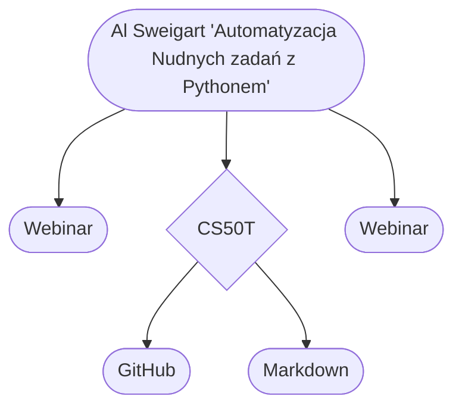
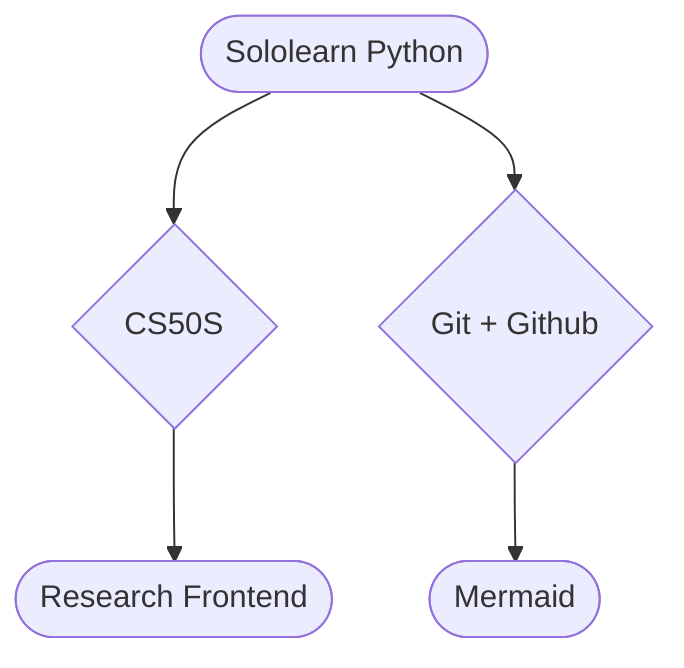

# Moja droga do IT 

## **Spis Treści**

WIP

## Wstęp

Cześć! 

Mam na imię Kamil, jestem magistrem historii i mam 28 (wkrótce 29) lat. Doświadczyłem w swoim życiu sporo: kiepska praca fizyczna, bez rozwojowe korpo, bezrobocie czy żenująca walka o posadę z najniższą krajową płacą. Kiedy dowiedziałem się, że na ostatnią posadę, na którą składałem CV rywalizować musiałem z około 80 innymi osobami (pracę mógłby wykonywać kompletnie każdy, ale do walki o posadę w szranki stanęło kilkunastu magistrów) podjąłem decyzję o przebranżowieniu. 

Studia historyczne, hobby i humanistyczne pasje nie kojarzą się za mocno z programowaniem, jednak uważam, że takie holistyczne przygotowanie dają mi mocny fundament pod nowe życiowe okoliczności. 

W tym repozytorium będę dokumentował całą moją drogę do stania się programistą. Uczę się od innych, jednak w nadmiarze informacji łatwo się zgubić, stąd być może moje rozważania i wykarzczowana przeze mnie droga pomoże w przyszłości komuś innemu. Czas pokaże.

Per Aspera Ad Astra.

---

### Początki
14.07 - 17.07
Na początku było sporo filmików na YT dlaczego warto zacząć. Po podjęciu decyzji sięgnąlem po książkę Al Sweigarta "Automatyzacja nudnych zadań z Pythonem" ale po około 20% porzuciłem ją- inne rzeczy o wiele bardziej mnie podjarały, ale jeszcze do niej wrócę.\
Później były 2 webinary "jak wejść do IT" i o początkach w .NET. Raczej średnie, ponieważ oba skończyły się próbą sprzedaży bardzo drogich kursów i/lub Codecampów.\
Założyłem też konto na Githubie i stworzyłem własny cheatsheet "Markdown". Spodobało mi się pisanie dokumentacji, więc własna ściąga się przyda.

---
### Pierwszy tydzień
18.07 - 24.07
Nowy tydzień zaczęty od konta i aplikacji "Sololearn". Bardzo fajny dodatek- autobus, kolejka u lekarza, brak dostępu do komputera= mała 2min lekcja w apce. Nie jest idealnie, ale wypełnia świetną nisze, czyli "martwe chwile" w których nie masz dostępu do spokojnej nauki w domu przy PC.\
Kolejny wpadł kurs Youtube na obsługę Gita (git add, git commit, git push etc.)\
Ogarnąłem też cały kurs Harvardzki CS50S (Programowanie w Scratch) świetna sprawa na wprowadzenie do programowania.\
Na końcu wpadł mały kursik w Mermaid czyli niejako "dodatku" do Markdown, ktory pozwala tworzyć takie właśnie drzewka jak w tym dokumencie. 

---
### Drugi tydzień
25.07 - 31.07

### Trzeci tydzień
01.08 - 07.08
